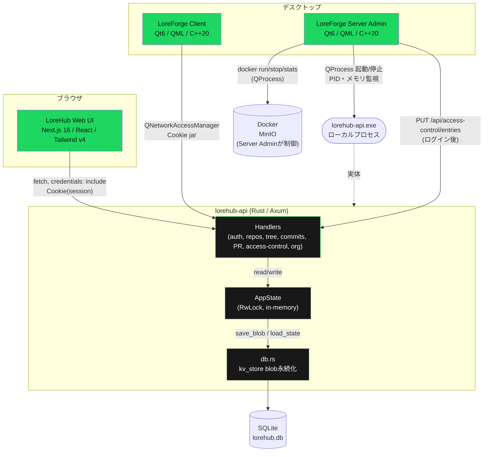
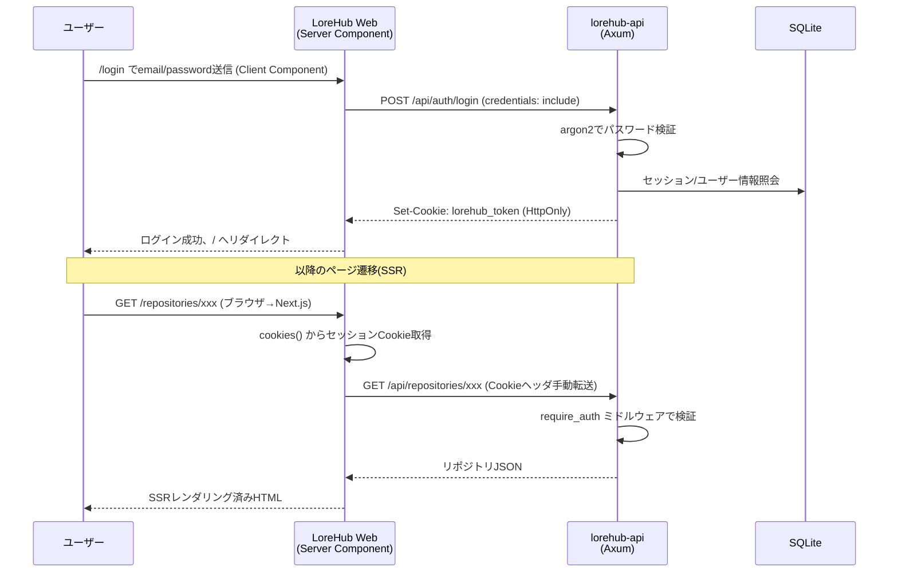
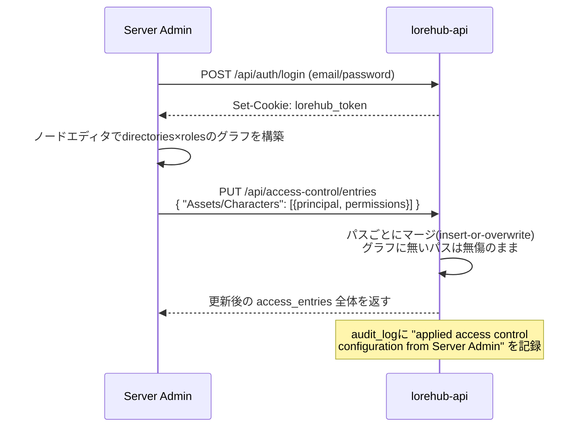
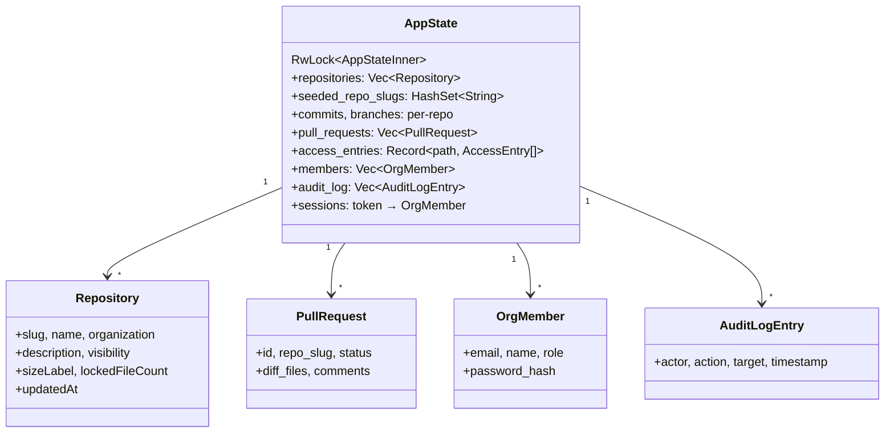
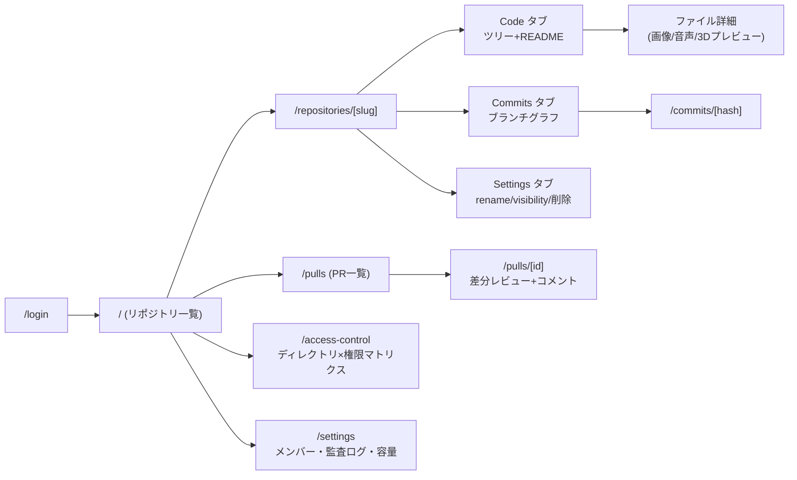
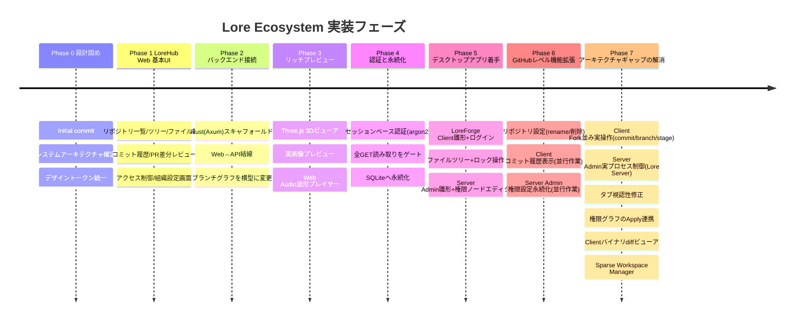
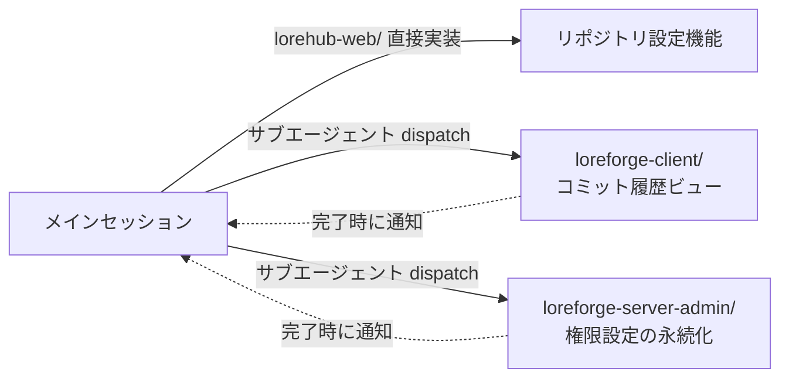
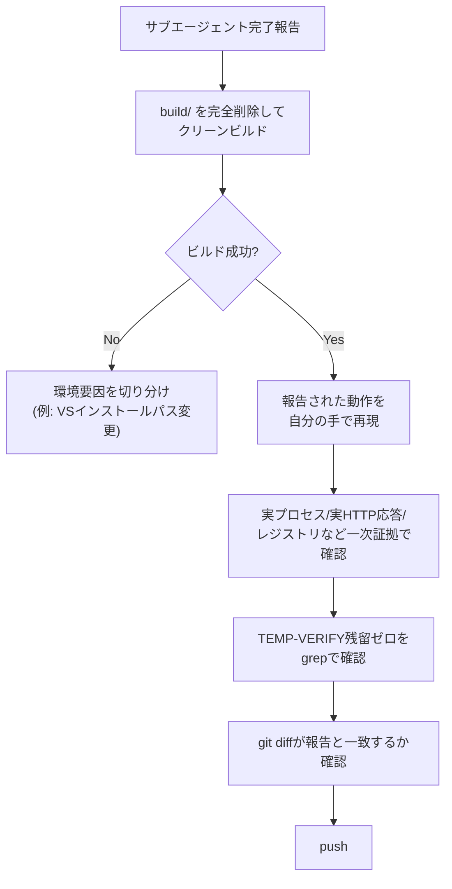

# Lore Ecosystem — アーキテクチャ & 設計ドキュメント

> このドキュメントは `ARCHITECTURE.md` / `DESIGN.md` / `LOREHUB_UI_SPEC.md` / `QUALITY_STANDARDS.md` と、ここまでの実装(git log)を統合した俯瞰資料です。個別の設計判断の一次情報源はリポジトリ直下の4ファイルを参照してください。

## 1. プロジェクト概要

**Lore** という架空の「巨大バイナリ対応の次世代VCS」を中心に、3つの独立コンポーネントからなるエコシステムを構築している。

| コンポーネント | 役割 | 立ち位置の例え |
|---|---|---|
| **LoreHub** | Webブラウザからリポジトリ閲覧・PR・権限管理 | GitHub / GitLab |
| **LoreForge Client** | デスクトップのVCSクライアント | Fork / GitKraken |
| **LoreForge Server Admin** | Loreサーバー環境をGUIで構築・管理 | Docker Desktop + 権限エディタ |

3つとも見た目の一貫性を保つため、単一のデザイントークン(`DESIGN.md`)を共有している。

## 2. システム構成図

**現状の実装範囲の注記**: `ServerAdmin → ServerProc`(実プロセス起動/停止/PID・メモリ監視)と `ServerAdmin → Handlers`(権限グラフのApply)はどちらも実データで動作する実装。`ServerAdmin → Docker` のMinIO制御も実際の `docker` CLIを呼び出す実装だが、この開発環境にDockerが未インストールのため実機検証はできていない(コードレビューベース)。LoreHub WebとLoreForge Clientはどちらも同一の `lorehub-api` に接続しており、片方で作った変更がもう片方にリアルタイムで反映されることを確認済み。

## 3. コンポーネント詳細

### 3.1 LoreHub (Web)

- **フロントエンド**: Next.js 16 (App Router, Server Components), TypeScript, Tailwind CSS v4
- **バックエンド**: Rust (Axum), tokio, sqlx(SQLite), argon2, tower-http CORS
- **主要画面**: リポジトリ一覧 / ツリー閲覧 / ファイル詳細(画像・音声・3Dプレビュー) / コミット履歴(ブランチグラフ) / PR差分レビュー / アクセス制御 / 組織設定 / **リポジトリ設定(rename・削除)**
- **認証**: HttpOnlyセッションCookie。Server Componentは `next/headers` の `cookies()` からCookieを読み取りAPIへ転送(`auth-server.ts`)。Client Componentは `credentials: "include"` でブラウザが自動送信。

### 3.2 LoreForge Client (Desktop)

- **UI**: Qt6 / QML、`QML_ELEMENT` マクロでC++型をQMLに公開
- **ロジック**: C++20、`QNetworkAccessManager` + Cookie jarでlorehub-apiと直接通信(Web版と同一バックエンドを共有)
- **実装済み**:
  - ログイン画面、リポジトリ一覧(実データ取得)
  - ファイルツリー閲覧 + ロック/アンロック操作、グローバル検索
  - コミット履歴ビュー(ブランチ別カラーリング、マージコミット表示)
  - **Fork並みの実操作**: ファイルのステージング(Added/Modified/Deleted)、コミット作成、ブランチ作成/切替、Pull(明示的な再フェッチ)
  - **バイナリDiffビューア**: 画像Before/Afterスライダー(`LoreImageProvider` による認証付き非同期画像取得)、3Dモデルの視覚的Diffトグル(スタイライズされたワイヤーフレーム代替表現)
  - **Sparse Workspace Manager**: ディレクトリ単位でワークスペースに含める/含めないを選択、`QSettings` でリポジトリごとに永続化。除外時は配下の選択も連鎖的に解除
- **今後**: 実バイナリアセットのアップロード/差分生成(現状はサーバー側デモデータを参照)

### 3.3 LoreForge Server Admin (Desktop)

- **UI**: Qt6 / QML、ノードエディタ風の権限設定UI
- **ロジック**: C++20、`QProcess` によるDocker制御(`DockerController`)とローカルプロセス制御(`LoreServerController`)
- **実装済み**:
  - 環境ステータスパネル(MinIO/Lore Serverの2カード)
  - **Lore Server実制御**: `lorehub-api.exe` をローカルプロセスとして起動/停止、PID・メモリ使用量(`tasklist` 経由)を監視。アプリ終了時も子プロセスを確実に回収(orphan防止)
  - MinIODocker制御(`docker run`/`stop`/`ps`/`stats`、CPU/RAM表示)— コード実装済みだがこの開発環境にDocker未インストールのため実機未検証
  - ディレクトリ×ロールのノードエディタUI、権限設定のローカル永続化(JSON)
  - **権限グラフのApply**: ログインしてlorehub-apiへ `PUT /api/access-control/entries` を送信し、ノードエディタの権限グラフを実サーバーへ反映(パスごとのマージ、対象外パスは無傷)
- **今後**: ノードエディタでのディレクトリ/ロール追加・削除UI(現状は既定の5+3ノード構成が前提)

## 4. データフロー: 認証シーケンス

**設計判断**: 当初は「書き込み系のみ認証必須」だったが、GETの素通し(読み取りが誰でも可能)を自己発見しギャップとして塞ぎ、全エンドポイントを `require_auth` ミドルウェア配下に統一した。

### 4.1 権限グラフのApply(Server Admin → lorehub-api)

Server Adminのノードエディタで組んだ権限グラフは、当初はローカルJSONファイルに保存するだけで実サーバーと無関係だった。以下のフローで実際にlorehub-apiへ反映されるようになっている。

**設計判断**: `PUT` は全置換ではなく「グラフに含まれるパスだけを上書きし、それ以外は触らない」マージ方式。Server Adminの既定グラフ(5ディレクトリ)がlorehub-apiのデモ全パスを網羅していないため、全置換だと未対応パスのデモデータが消えてしまう。

## 5. データモデル (AppState)

**永続化方式**: フルリレーショナル正規化ではなく、フィールドごとに1レコードのJSONブロブを `kv_store` テーブルへ保存する方式を採用(`db.rs`)。トレードオフとして複雑なクエリはできないが、Rust側の構造体をそのまま `serde_json` でシリアライズでき、スキーマ移行の手間がない。デモ規模のデータ量では十分と判断し、意図的に選択した。

## 6. LoreHub Web サイトマップ

## 7. デザインシステム概要

Spotify風ダークUIをベースに、LoreHub Web(CSS変数/Tailwind theme)とQt/QML(`Theme.qml`)の両方が同じ値を参照する「Cross-Platform Token Mapping」を`DESIGN.md` §10に定義。

| トークン | 値 | Web (CSS変数) | Qt/QML |
|---|---|---|---|
| 背景(最深部) | `#121212` | `--color-bg-base` | `Theme.colorBackgroundBase` |
| サーフェス | `#181818` | `--color-bg-surface` | `Theme.colorSurface` |
| アクセント(機能用途限定) | `#1ed760` | `--color-accent` | `Theme.colorAccent` |
| テキスト(主) | `#ffffff` | `--color-text-base` | `Theme.colorTextPrimary` |
| テキスト(副) | `#b3b3b3` | `--color-text-muted` | `Theme.colorTextSecondary` |
| エラー | `#f3727f` | `--color-negative` | `Theme.colorNegative` |
| 標準角丸 | 6px | `--radius-standard` | `radius: Theme.radiusStandard` |
| ピル角丸 | 500px | `--radius-pill` | `radius: height / 2`(実行時計算) |

## 8. 開発の歩み

## 9. マルチエージェント並行開発

Phase 6では、3つの独立した作業(Web機能拡張・Client機能拡張・Server Admin機能拡張)をディレクトリが重ならない形で分割し、バックグラウンドサブエージェントとして並行実行した。

各エージェントには同じ「クラッシュ調査手法」(`PrintWindow`によるスクリーンショット、`MSYS_NO_PATHCONV=1`、QML singleton診断法など)を事前共有し、独立して発見した問題の再発を防いだ。

### 9.1 独立再検証パターン

Phase 7では、サブエージェントの完了報告を鵜呑みにせず、オーケストレーター(メインセッション)が毎回ゼロから独立して再検証するパターンを徹底した。

この過程で、報告だけでは分からない実環境の変化(Visual Studioのインストールパスが `2022` フォルダから `18` フォルダへ自動更新されていた事実)や、検証手法そのものの欠陥(QMLの `console.log` がリダイレクトされたログファイルへ確実にフラッシュされない問題、複雑な画面遷移を伴うTimerチェーンより単機能の検証用QMLを直接ロードする方が確実、という教訓)を発見した。**「動きました」という報告と、実際に動くことは別物**という前提に立ち、毎回一次証拠(実プロセスのPID、実HTTPレスポンス、レジストリの値そのもの)を自分で取得することを徹底した。

## 10. 現在の状態(このドキュメント作成時点)

- ✅ LoreHub Web: 8画面すべて実装、認証・永続化・リポジトリ設定(rename/削除)まで完了、lint/build検証済み
- ✅ lorehub-api: 全エンドポイント認証必須化、SQLite永続化、リポジトリのCRUD完備、VCS書き込みAPI(commit/branch/stage)完備、access-control Apply対応
- ✅ LoreForge Client: 閲覧+ロック操作に加え、Fork並みの実操作(コミット/ブランチ/ステージング)、バイナリDiffビューア、Sparse Workspace Managerまで完備
- ✅ LoreForge Server Admin: 実プロセスとしてのLore Server制御(起動/停止/PID/メモリ監視)、権限グラフの実サーバーへのApply、タブ視認性修正まで完備。MinIOのDocker制御はコード実装済みだが実機(Docker)未検証
- ⏳ 未着手: LoreForge Clientでの実バイナリアセットアップロード/差分生成、Server Adminのノードエディタでのディレクトリ/ロール追加・削除UI、MinIO Docker制御の実機検証
