# Lore Ecosystem — アーキテクチャ & 設計ドキュメント

> このドキュメントは `ARCHITECTURE.md` / `DESIGN.md` / `LOREHUB_UI_SPEC.md` / `QUALITY_STANDARDS.md` と、ここまでの実装(git log)を統合した俯瞰資料です。個別の設計判断の一次情報源はリポジトリ直下の4ファイルを参照してください。

## 1. プロジェクト概要

**Lore** という架空の「巨大バイナリ対応の次世代VCS」を中心に、3つの独立コンポーネントからなるエコシステムを構築している。

| コンポーネント | 役割 | 立ち位置の例え |
|---|---|---|
| **LoreHub** | Webブラウザからリポジトリ閲覧・PR・権限管理 | GitHub / GitLab |
| **LoreForge Client** | デスクトップのVCSクライアント | Fork / GitKraken |
| **LoreForge Server Admin** | Loreサーバー環境をGUIで構築・管理 | Docker Desktop + 権限エディタ |

3つとも見た目の一貫性を保つため、単一のデザイントークン(`DESIGN.md`)を共有している。

## 2. システム構成図

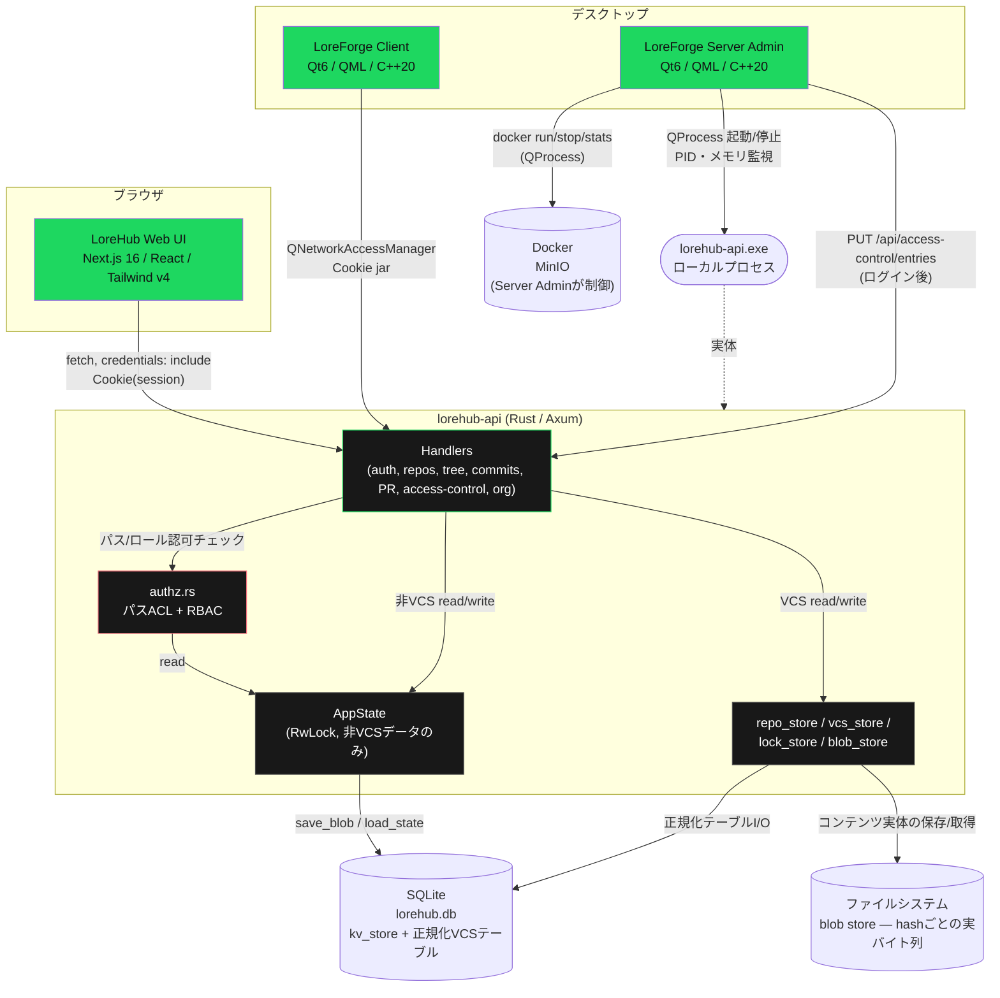
```mermaid
graph TB
    subgraph Browser["ブラウザ"]
        WebUI["LoreHub Web UI<br/>Next.js 16 / React / Tailwind v4"]
    end

    subgraph Desktop["デスクトップ"]
        Client["LoreForge Client<br/>Qt6 / QML / C++20"]
        ServerAdmin["LoreForge Server Admin<br/>Qt6 / QML / C++20"]
    end

    subgraph Backend["lorehub-api (Rust / Axum)"]
        Handlers["Handlers<br/>(auth, repos, tree, commits, PR, access-control, org)"]
        Authz["authz.rs<br/>パスACL + RBAC"]
        AppState["AppState<br/>(RwLock, 非VCSデータのみ)"]
        VcsStore["repo_store / vcs_store /<br/>lock_store / blob_store"]
    end

    SQLite[("SQLite<br/>lorehub.db<br/>kv_store + 正規化VCSテーブル")]
    Blobs[("ファイルシステム<br/>blob store — hashごとの実バイト列")]
    Docker[("Docker<br/>MinIO<br/>(Server Adminが制御)")]
    ServerProc(["lorehub-api.exe<br/>ローカルプロセス"])

    WebUI -- "fetch, credentials: include<br/>Cookie(session)" --> Handlers
    Client -- "QNetworkAccessManager<br/>Cookie jar" --> Handlers
    Handlers -- "パス/ロール認可チェック" --> Authz
    Authz -- "read" --> AppState
    Handlers -- "非VCS read/write" --> AppState
    Handlers -- "VCS read/write" --> VcsStore
    AppState -- "save_blob / load_state" --> SQLite
    VcsStore -- "正規化テーブルI/O" --> SQLite
    VcsStore -- "コンテンツ実体の保存/取得" --> Blobs
    ServerAdmin -- "docker run/stop/stats<br/>(QProcess)" --> Docker
    ServerAdmin -- "QProcess 起動/停止<br/>PID・メモリ監視" --> ServerProc
    ServerAdmin -- "PUT /api/access-control/entries<br/>(ログイン後)" --> Handlers
    ServerProc -.->|"実体"| Backend

    style WebUI fill:#1ed760,color:#121212
    style Client fill:#1ed760,color:#121212
    style ServerAdmin fill:#1ed760,color:#121212
    style Handlers fill:#181818,color:#fff,stroke:#1ed760
    style Authz fill:#181818,color:#fff,stroke:#f3727f
    style AppState fill:#181818,color:#fff,stroke:#4d4d4d
    style VcsStore fill:#181818,color:#fff,stroke:#4d4d4d
```

**現状の実装範囲の注記**: `ServerAdmin → ServerProc`(実プロセス起動/停止/PID・メモリ監視)、`ServerAdmin → Handlers`(権限グラフのApply)、`ServerAdmin → Docker` のMinIO制御(`docker run`/`stop`/`ps`/`stats`)はすべて実データ・実Docker環境で動作確認済み(コンテナの起動・ポートマッピング・`docker stats`による実CPU/メモリ取得・停止まで実機検証)。LoreHub WebとLoreForge Clientはどちらも同一の `lorehub-api` に接続しており、片方で作った変更がもう片方にリアルタイムで反映されることを確認済み。

**書き込み経路についての注記(VCS再設計後)**: `AppState -- save_blob / load_state --> SQLite` という経路は、PR一覧・アクセス制御・組織メンバー・監査ログ・セッションなど非VCSデータにのみ適用される。リポジトリ・コミット・ブランチ・ファイルツリー・ロックなどVCSデータは `AppState` を経由せず、`repo_store.rs`/`vcs_store.rs`/`lock_store.rs` が実コンテンツアドレス方式の正規化SQLテーブル(同じ`lorehub.db`内)へ直接読み書きし、ファイル実体(SHA-256ハッシュで名前付けされたバイト列)は`blob_store.rs`経由でDBの外、ファイルシステムに保存される(§5参照)。この構成のDocker上での実際の配置(named volume・バックアップ対象)は`docs/DEPLOYMENT.md`のバックアップ節、§11も参照。

**認可についての注記**: `Handlers -- パス/ロール認可チェック --> Authz` は、tree/content/image/audio/upload/lock/stage/diffなどパスが絡む全てのVCS系エンドポイントが通過するゲート。以前はこの経路自体が存在せず、認証さえ通れば誰でも任意のパスを読み書きできた(§10参照)。

## 3. コンポーネント詳細

### 3.1 LoreHub (Web)

- **フロントエンド**: Next.js 16 (App Router, Server Components), TypeScript, Tailwind CSS v4
- **バックエンド**: Rust (Axum), tokio, sqlx(SQLite), argon2, tower-http CORS
- **主要画面**: リポジトリ一覧 / ツリー閲覧 / ファイル詳細(画像・音声・3Dプレビュー) / コミット履歴(ブランチグラフ) / PR差分レビュー / アクセス制御 / 組織設定 / **リポジトリ設定(rename・削除)**
- **認証**: HttpOnlyセッションCookie(アクセス+リフレッシュのデュアルトークン)。Server Componentは `next/headers` の `cookies()` からCookieを読み取りAPIへ転送(`auth-server.ts`)。Client Componentは `credentials: "include"` でブラウザが自動送信。トークン失効時はCSR/SSR両経路で透過的に自動リフレッシュ(§4.2参照)。
- **プレビューの実配信**: `StreamingPreview.tsx` は当初「700msの偽プログレスバー」で本物のチャンク配信を模していたが、`fetch().body.getReader()` で実バイト受信量に基づく進捗表示に置き換え、バックエンドも本物のHTTP Range(`206 Partial Content`/`416`)に対応済み(§4.3参照)。

### 3.2 LoreForge Client (Desktop)

- **UI**: Qt6 / QML、`QML_ELEMENT` マクロでC++型をQMLに公開
- **ロジック**: C++20、`QNetworkAccessManager` + Cookie jarでlorehub-apiと直接通信(Web版と同一バックエンドを共有)
- **実装済み**:
  - ログイン画面、リポジトリ一覧(実データ取得)
  - ファイルツリー閲覧 + ロック/アンロック操作、グローバル検索
  - コミット履歴ビュー(ブランチ別カラーリング、マージコミット表示)
  - **Fork並みの実操作**: ファイルのステージング(Added/Modified/Deleted)、コミット作成、ブランチ作成/切替、Pull(明示的な再フェッチ)
  - **バイナリDiffビューア**: 画像Before/Afterスライダー(`LoreImageProvider` による認証付き非同期画像取得)、3Dモデルの視覚的Diffトグル(スタイライズされたワイヤーフレーム代替表現)
  - **Sparse Workspace Manager**: ディレクトリ単位でワークスペースに含める/含めないを選択、`QSettings` でリポジトリごとに永続化。除外時は配下の選択も連鎖的に解除
  - **実アセットアップロード**: 画像/テキスト/音声ファイルをローカルから選んでlorehub-apiへアップロードし、実バイトを保存(リポジトリ単位で分離、種別はパスの拡張子から推定)。成功時に自動でAdded扱いとしてステージング。3Dモデルは意図的に対象外(Web/Client双方に実ジオメトリを読み込む仕組みが無く、アップロードしても反映先が無いため)
  - **テキスト/音声プレビュー**: テキストファイルは `Flickable` + 読み取り専用 `TextEdit` でスクロール可能表示。音声は `AudioPlayerController`(`QMediaPlayer` + 認証付き非同期フェッチ)で実再生・シーク対応
  - **セッション自動延長**: `AuthController` が25分ごとに `POST /api/auth/refresh` を送信し、30分のアクセストークンTTLより先にセッションを更新(§4.2参照)
- **今後**: なし(Fork並みの実操作・プレビュー・アップロード・セッション延長まで一通り完了)

### 3.3 LoreForge Server Admin (Desktop)

- **UI**: Qt6 / QML、ノードエディタ風の権限設定UI
- **ロジック**: C++20、`QProcess` によるDocker制御(`DockerController`)とローカルプロセス制御(`LoreServerController`)
- **実装済み**:
  - 環境ステータスパネル(MinIO/Lore Serverの2カード)
  - **Lore Server実制御**: `lorehub-api.exe` をローカルプロセスとして起動/停止、PID・メモリ使用量(`tasklist` 経由)を監視。アプリ終了時も子プロセスを確実に回収(orphan防止)
  - MinIODocker制御(`docker run`/`stop`/`ps`/`stats`、CPU/RAM表示)— 実Docker環境で動作確認済み
  - **動的ノードエディタ**: ディレクトリ/ロールノードを自由に追加・削除可能(既定の5+3ノード構成は初期値であり上限ではない)。ノード削除時は関連する接続も連鎖的に除去、`QSettings`ではなくJSON設定ファイルへ永続化
  - **権限グラフのApply**: ログインしてlorehub-apiへ `PUT /api/access-control/entries` を送信し、ノードエディタの権限グラフを実サーバーへ反映(パスごとのマージ、対象外パスは無傷)。動的追加したノードでも同じパイプラインで動作確認済み
  - **セッション自動延長**: `PermissionConfigController` も同じく25分ごとに `POST /api/auth/refresh`(Client側と全く同じパターン、Apply機能のログインセッションを維持)
- **今後**: なし(Qt Test基盤も含め一通り完了。§9.2参照)

## 4. データフロー: 認証シーケンス

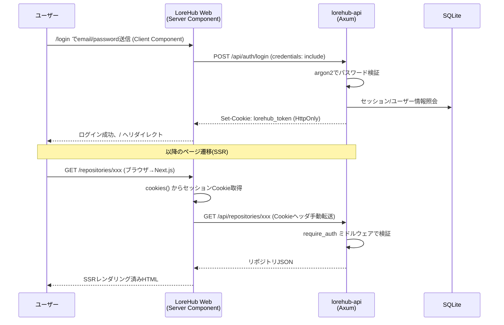
```mermaid
sequenceDiagram
    participant U as ユーザー
    participant Web as LoreHub Web<br/>(Server Component)
    participant API as lorehub-api<br/>(Axum)
    participant DB as SQLite

    U->>Web: /login でemail/password送信 (Client Component)
    Web->>API: POST /api/auth/login (credentials: include)
    API->>API: argon2でパスワード検証
    API->>DB: セッション/ユーザー情報照会
    API-->>Web: Set-Cookie: lorehub_token (HttpOnly)
    Web-->>U: ログイン成功、/ へリダイレクト

    Note over U,API: 以降のページ遷移(SSR)
    U->>Web: GET /repositories/xxx (ブラウザ→Next.js)
    Web->>Web: cookies() からセッションCookie取得
    Web->>API: GET /api/repositories/xxx (Cookieヘッダ手動転送)
    API->>API: require_auth ミドルウェアで検証
    API-->>Web: リポジトリJSON
    Web-->>U: SSRレンダリング済みHTML
```

**設計判断**: 当初は「書き込み系のみ認証必須」だったが、GETの素通し(読み取りが誰でも可能)を自己発見しギャップとして塞ぎ、全エンドポイントを `require_auth` ミドルウェア配下に統一した。

### 4.1 権限グラフのApply(Server Admin → lorehub-api)

Server Adminのノードエディタで組んだ権限グラフは、当初はローカルJSONファイルに保存するだけで実サーバーと無関係だった。以下のフローで実際にlorehub-apiへ反映されるようになっている。

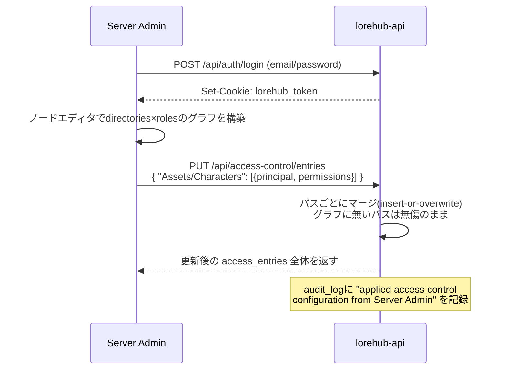
```mermaid
sequenceDiagram
    participant Admin as Server Admin
    participant API as lorehub-api

    Admin->>API: POST /api/auth/login (email/password)
    API-->>Admin: Set-Cookie: lorehub_token
    Admin->>Admin: ノードエディタでdirectories×rolesのグラフを構築
    Admin->>API: PUT /api/access-control/entries<br/>{ "Assets/Characters": [{principal, permissions}] }
    API->>API: パスごとにマージ(insert-or-overwrite)<br/>グラフに無いパスは無傷のまま
    API-->>Admin: 更新後の access_entries 全体を返す
    Note over API: audit_logに "applied access control<br/>configuration from Server Admin" を記録
```

**設計判断**: `PUT` は全置換ではなく「グラフに含まれるパスだけを上書きし、それ以外は触らない」マージ方式。Server Adminの既定グラフ(5ディレクトリ)がlorehub-apiのデモ全パスを網羅していないため、全置換だと未対応パスのデモデータが消えてしまう。

### 4.2 セッションのリフレッシュ

アクセストークンは30分でサーバー側が失効させる。放置すると全リクエストが401になるため、クライアントごとに異なる復旧経路を持つ。

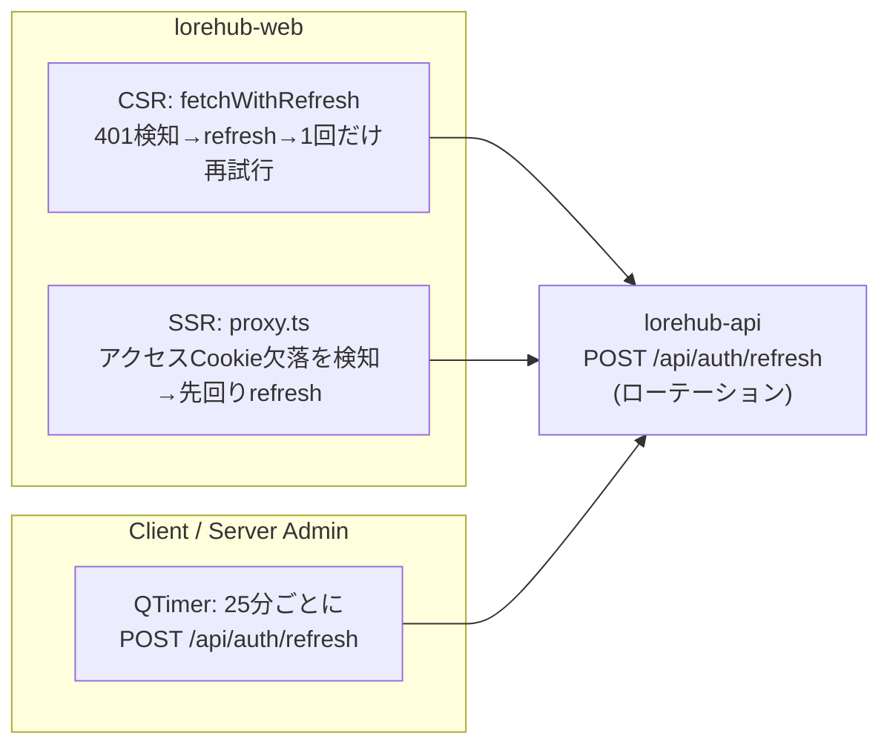
```mermaid
flowchart LR
    subgraph Web["lorehub-web"]
        CSR["CSR: fetchWithRefresh<br/>401検知→refresh→1回だけ再試行"]
        SSR["SSR: proxy.ts<br/>アクセスCookie欠落を検知→先回りrefresh"]
    end
    subgraph Desktop["Client / Server Admin"]
        Timer["QTimer: 25分ごとに<br/>POST /api/auth/refresh"]
    end
    API["lorehub-api<br/>POST /api/auth/refresh<br/>(ローテーション)"]

    CSR --> API
    SSR --> API
    Timer --> API
```

Web(CSR/SSR)は「失効を検知してから直す」リアクティブ方式、デスクトップアプリ(Client/Server Admin)は「失効前に定期更新する」プロアクティブ方式 — 個々のリクエストへの401リトライをQNetworkReplyベースの全呼び出し箇所に後付けするより、単純なタイマーの方がデスクトップアプリのセッションライフサイクルには適切と判断した。リフレッシュ失敗時(リフレッシュトークン自体の失効やサーバーダウン)はタイマーを止めてログアウト状態に遷移し、ゾンビタイマーが失敗し続けることを防ぐ。

### 4.3 バイナリプレビューの実配信(HTTP Range)

`get_image`/`get_image_before`/`get_audio`/`get_file_content` はいずれも `Range: bytes=<start>-<end>` リクエストヘッダを解釈し、`206 Partial Content`(`Content-Range`/`Accept-Ranges`付き)または範囲外なら `416 Range Not Satisfiable` を返す。`Range`ヘッダが無い場合は従来通り全量を `200` で返す(`Accept-Ranges: bytes` を追加で広告)。`get_file_content` はこの変更に合わせ `{"content": "..."}` のJSON包装をやめ、生の `text/plain; charset=utf-8` バイト列を直接返すよう変更した(JSONドキュメントの一部だけを切り出しても意味が無いため)。

## 5. データモデル (AppState / VCS正規化テーブル)

VCS再設計(本ドキュメント執筆時点で完了済み)により、`Repository`・コミット・ブランチ・ファイルツリーは `AppState` から切り離され、実コンテンツアドレス方式の正規化SQLテーブルへ移った。`AppState` に残るのは非VCSデータのみ。

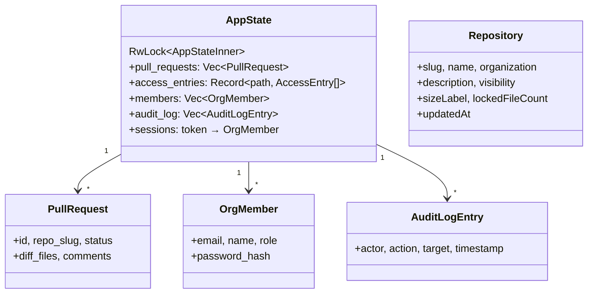
```mermaid
classDiagram
    class AppState {
        RwLock~AppStateInner~
        +pull_requests: Vec~PullRequest~
        +access_entries: Record~path, AccessEntry[]~
        +members: Vec~OrgMember~
        +audit_log: Vec~AuditLogEntry~
        +sessions: token → OrgMember
    }
    class Repository {
        +slug, name, organization
        +description, visibility
        +sizeLabel, lockedFileCount
        +updatedAt
    }
    class PullRequest {
        +id, repo_slug, status
        +diff_files, comments
    }
    class OrgMember {
        +email, name, role
        +password_hash
    }
    class AuditLogEntry {
        +actor, action, target, timestamp
    }
    AppState "1" --> "*" PullRequest
    AppState "1" --> "*" OrgMember
    AppState "1" --> "*" AuditLogEntry
```

一方、VCSデータ(`Repository`本体・コミット・ブランチ・ツリー・ファイル実体)は上記`AppState`の外、実コンテンツアドレス方式の正規化SQLテーブルとして保存される。中心にあるのは`file_blobs`(SHA-256ハッシュをキーとする実バイト列のメタデータ)で、コミット・ツリースナップショットはどちらもこのハッシュを指すことで内容を共有・重複排除する。

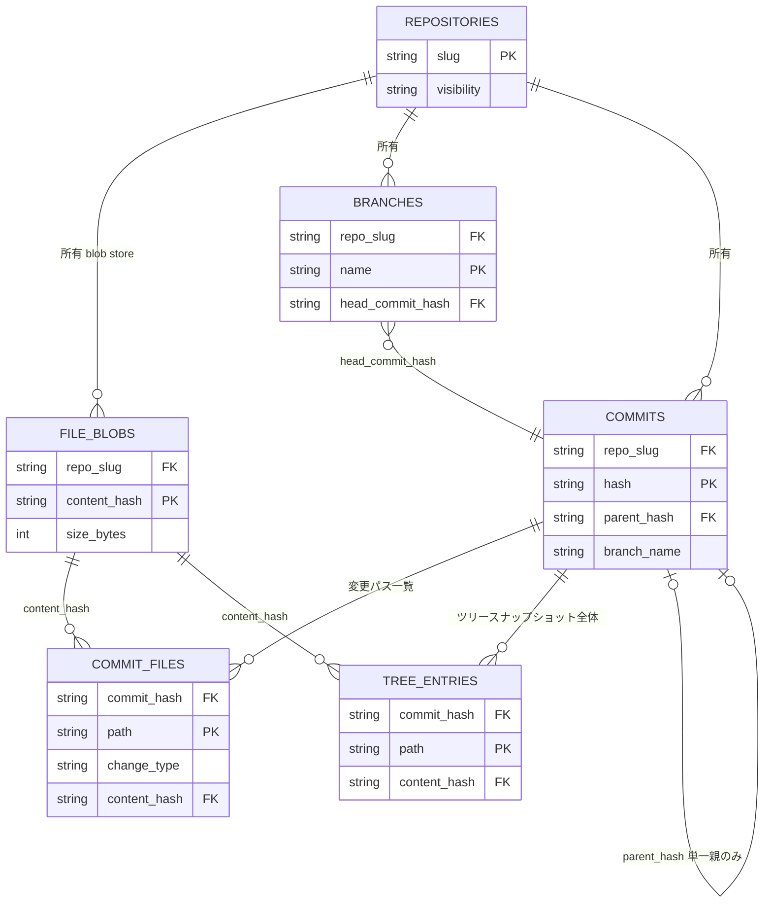
```mermaid
erDiagram
    REPOSITORIES ||--o{ FILE_BLOBS : "所有 blob store"
    REPOSITORIES ||--o{ BRANCHES : "所有"
    REPOSITORIES ||--o{ COMMITS : "所有"
    COMMITS ||--o{ COMMIT_FILES : "変更パス一覧"
    COMMITS ||--o{ TREE_ENTRIES : "ツリースナップショット全体"
    COMMITS |o--o| COMMITS : "parent_hash 単一親のみ"
    BRANCHES }o--|| COMMITS : "head_commit_hash"
    FILE_BLOBS ||--o{ COMMIT_FILES : "content_hash"
    FILE_BLOBS ||--o{ TREE_ENTRIES : "content_hash"

    REPOSITORIES {
        string slug PK
        string visibility
    }
    FILE_BLOBS {
        string repo_slug FK
        string content_hash PK
        int size_bytes
    }
    BRANCHES {
        string repo_slug FK
        string name PK
        string head_commit_hash FK
    }
    COMMITS {
        string repo_slug FK
        string hash PK
        string parent_hash FK
        string branch_name
    }
    COMMIT_FILES {
        string commit_hash FK
        string path PK
        string change_type
        string content_hash FK
    }
    TREE_ENTRIES {
        string commit_hash FK
        string path PK
        string content_hash FK
    }
```

図中のキーは代表列のみ(実際の主キーは全テーブルで`repo_slug`との複合キー)。`current_branch`(リポジトリごとの現在ブランチ名)・`staged_content`(未コミットの作業コピー、パスごとに現在値1つ)・`pending_changes`(ステージ済み変更、git indexに相当)・`file_locks`(コミット履歴とは独立した排他ロック)も同じ`repositories`配下に存在するが、可読性のため図からは省略した。正確なカラム・制約・インデックスは `lorehub-api/migrations/0001_vcs_schema.sql` を一次情報源とする。全テーブルの`repo_slug`外部キーは`ON DELETE CASCADE`で宣言されており、`repositories`から1行削除するだけで関連する全VCSデータが原子的に消える(以前は`Vec<Repository>`+8個の独立したHashMapという構造で、リポジトリ削除がそのうち3箇所しかクリーンアップせず残り5箇所を永久にオーファン化させていた)。

**永続化方式**: 2方式が併存する。`pull_requests`/`access_entries`/`org_members`/`audit_log`/`sessions`など非VCSデータは、フィールドごとに1レコードのJSONブロブを `kv_store` テーブルへ保存する方式(`db.rs`)——複雑なクエリはできないが、Rust側の構造体をそのまま `serde_json` でシリアライズでき、スキーマ移行の手間がない。今回のVCS再設計ではスコープ外と判断し、そのまま維持している。一方 `Repository`・コミット・ブランチ・ツリースナップショット・ファイル実体(SHA-256コンテンツハッシュ)などVCSデータは正規化SQLテーブル(`repositories`/`commits`/`branches`/`tree_entries`/`file_blobs`など、スキーマは `lorehub-api/migrations/0001_vcs_schema.sql` が一次情報源)として保存され、もはや `AppState` の一部ではなく `repo_store.rs`/`vcs_store.rs`/`lock_store.rs` が直接読み書きする。

## 6. LoreHub Web サイトマップ

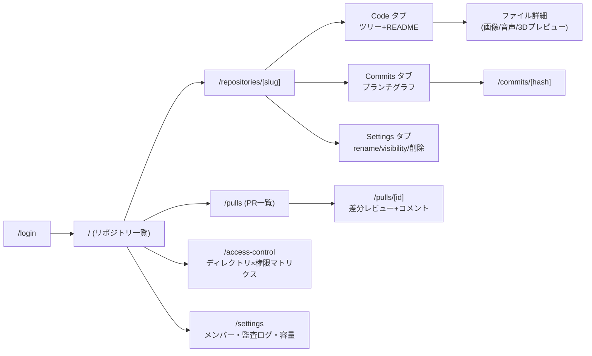
```mermaid
flowchart LR
    Login["/login"] --> Home["/ (リポジトリ一覧)"]
    Home --> Repo["/repositories/[slug]"]
    Repo --> Code["Code タブ<br/>ツリー+README"]
    Repo --> Commits["Commits タブ<br/>ブランチグラフ"]
    Repo --> Settings["Settings タブ<br/>rename/visibility/削除"]
    Code --> FileDetail["ファイル詳細<br/>(画像/音声/3Dプレビュー)"]
    Commits --> CommitDetail["/commits/[hash]"]
    Home --> Pulls["/pulls (PR一覧)"]
    Pulls --> PRDetail["/pulls/[id]<br/>差分レビュー+コメント"]
    Home --> AccessControl["/access-control<br/>ディレクトリ×権限マトリクス"]
    Home --> OrgSettings["/settings<br/>メンバー・監査ログ・容量"]
```

## 7. デザインシステム概要

Spotify風ダークUIをベースに、LoreHub Web(CSS変数/Tailwind theme)とQt/QML(`Theme.qml`)の両方が同じ値を参照する「Cross-Platform Token Mapping」を`DESIGN.md` §10に定義。

| トークン | 値 | Web (CSS変数) | Qt/QML |
|---|---|---|---|
| 背景(最深部) | `#121212` | `--color-bg-base` | `Theme.colorBackgroundBase` |
| サーフェス | `#181818` | `--color-bg-surface` | `Theme.colorSurface` |
| アクセント(機能用途限定) | `#1ed760` | `--color-accent` | `Theme.colorAccent` |
| テキスト(主) | `#ffffff` | `--color-text-base` | `Theme.colorTextPrimary` |
| テキスト(副) | `#b3b3b3` | `--color-text-muted` | `Theme.colorTextSecondary` |
| エラー | `#f3727f` | `--color-negative` | `Theme.colorNegative` |
| 標準角丸 | 6px | `--radius-standard` | `radius: Theme.radiusStandard` |
| ピル角丸 | 500px | `--radius-pill` | `radius: height / 2`(実行時計算) |

## 8. 開発の歩み

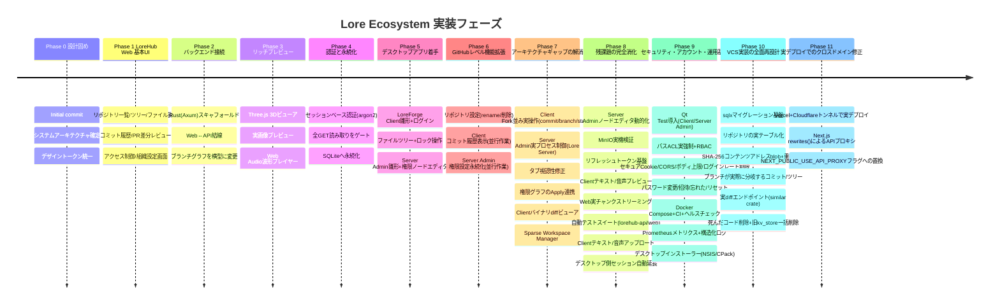
```mermaid
timeline
    title Lore Ecosystem 実装フェーズ
    Phase 0 設計固め : Initial commit : システムアーキテクチャ確定 : デザイントークン統一
    Phase 1 LoreHub Web 基本UI : リポジトリ一覧/ツリー/ファイル詳細 : コミット履歴/PR差分レビュー : アクセス制御/組織設定画面
    Phase 2 バックエンド接続 : Rust(Axum)スキャフォールド : Web⇔API結線 : ブランチグラフを横型に変更
    Phase 3 リッチプレビュー : Three.js 3Dビューア : 実画像プレビュー : Web Audio波形プレイヤー
    Phase 4 認証と永続化 : セッションベース認証(argon2) : 全GET読み取りをゲート : SQLiteへ永続化
    Phase 5 デスクトップアプリ着手 : LoreForge Client雛形+ログイン : ファイルツリー+ロック操作 : Server Admin雛形+権限ノードエディタ
    Phase 6 GitHubレベル機能拡張 : リポジトリ設定(rename/削除) : Client コミット履歴表示(並行作業) : Server Admin 権限設定永続化(並行作業)
    Phase 7 アーキテクチャギャップの解消 : Client Fork並み実操作(commit/branch/stage) : Server Admin実プロセス制御(Lore Server) : タブ視認性修正 : 権限グラフのApply連携 : Clientバイナリdiffビューア : Sparse Workspace Manager
    Phase 8 残課題の完全消化 : Server Adminノードエディタ動的化 : MinIO実機検証 : リフレッシュトークン基盤 : Clientテキスト/音声プレビュー : Web実チャンクストリーミング : 自動テストスイート(lorehub-api/web) : Clientテキスト/音声アップロード : デスクトップ側セッション自動延長
    Phase 9 セキュリティ・アカウント・運用基盤 : Qt Test導入(Client/Server Admin) : パスACL実強制+RBAC : セキュアCookie/CORS/ボディ上限/ログインレート制限 : パスワード変更/招待/忘れた/リセット : Docker Compose+CI+ヘルスチェック : Prometheusメトリクス+構造化ログ : デスクトップインストーラー(NSIS/CPack)
    Phase 10 VCS実装の全面再設計 : sqlxマイグレーション基盤 : リポジトリの実テーブル化 : SHA-256コンテンツアドレスblob+重複排除 : ブランチが実際に分岐するコミット/ツリー : 実diffエンドポイント(similar crate) : 死んだコード削除+旧kv_store一括削除
    Phase 11 実デプロイでのクロスドメイン修正 : Vercel+Cloudflareトンネルで実デプロイ : Next.js rewrites()によるAPIプロキシ : NEXT_PUBLIC_USE_API_PROXYフラグへの置換
```

## 9. マルチエージェント並行開発

Phase 6では、3つの独立した作業(Web機能拡張・Client機能拡張・Server Admin機能拡張)をディレクトリが重ならない形で分割し、バックグラウンドサブエージェントとして並行実行した。

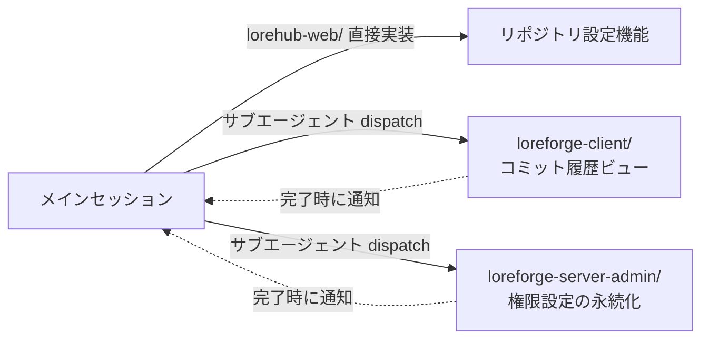
```mermaid
graph LR
    Orchestrator["メインセッション"]
    Orchestrator -->|"lorehub-web/ 直接実装"| WebWork["リポジトリ設定機能"]
    Orchestrator -->|"サブエージェント dispatch"| ClientAgent["loreforge-client/<br/>コミット履歴ビュー"]
    Orchestrator -->|"サブエージェント dispatch"| AdminAgent["loreforge-server-admin/<br/>権限設定の永続化"]
    ClientAgent -.->|"完了時に通知"| Orchestrator
    AdminAgent -.->|"完了時に通知"| Orchestrator
```

各エージェントには同じ「クラッシュ調査手法」(`PrintWindow`によるスクリーンショット、`MSYS_NO_PATHCONV=1`、QML singleton診断法など)を事前共有し、独立して発見した問題の再発を防いだ。

### 9.1 独立再検証パターン

Phase 7では、サブエージェントの完了報告を鵜呑みにせず、オーケストレーター(メインセッション)が毎回ゼロから独立して再検証するパターンを徹底した。

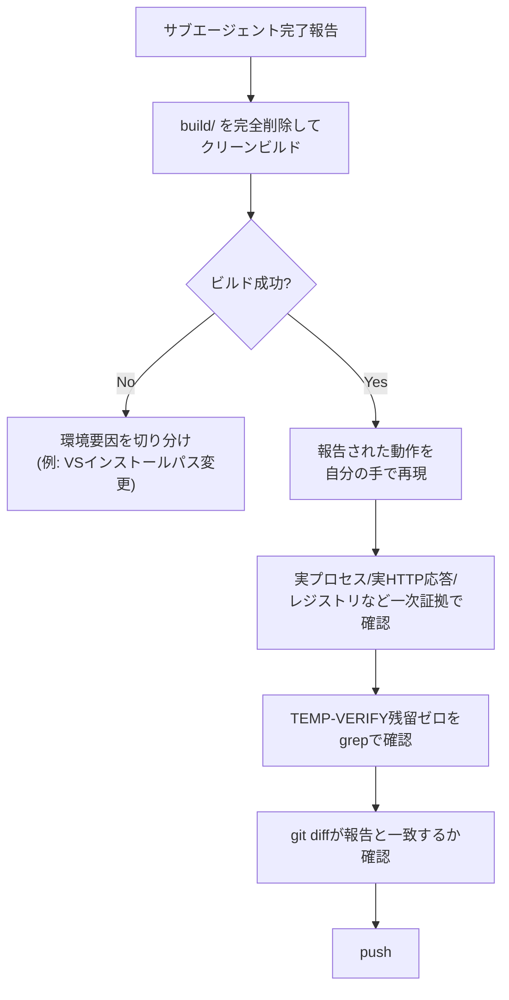
```mermaid
flowchart TD
    A["サブエージェント完了報告"] --> B["build/ を完全削除して<br/>クリーンビルド"]
    B --> C{"ビルド成功?"}
    C -->|No| D["環境要因を切り分け<br/>(例: VSインストールパス変更)"]
    C -->|Yes| E["報告された動作を<br/>自分の手で再現"]
    E --> F["実プロセス/実HTTP応答/<br/>レジストリなど一次証拠で確認"]
    F --> G["TEMP-VERIFY残留ゼロを<br/>grepで確認"]
    G --> H["git diffが報告と一致するか確認"]
    H --> I["push"]
```

この過程で、報告だけでは分からない実環境の変化(Visual Studioのインストールパスが `2022` フォルダから `18` フォルダへ自動更新されていた事実)や、検証手法そのものの欠陥(QMLの `console.log` がリダイレクトされたログファイルへ確実にフラッシュされない問題、複雑な画面遷移を伴うTimerチェーンより単機能の検証用QMLを直接ロードする方が確実、という教訓)を発見した。**「動きました」という報告と、実際に動くことは別物**という前提に立ち、毎回一次証拠(実プロセスのPID、実HTTPレスポンス、レジストリの値そのもの)を自分で取得することを徹底した。

### 9.2 自動テストスイート

Phase 8で `lorehub-api` と `lorehub-web` に、Phase 9で2つのQtデスクトップアプリにも自動テストを整備し、4系統全てに自動テストが揃った。

- **lorehub-api**: `tower::ServiceExt::oneshot` で実際の `Router` をTCPバインド無しにin-processで駆動する統合テスト、118件(Phase 8時点の39件から、Phase 9のセキュリティ強化・アカウントライフサイクル・Phase 10のVCS再設計それぞれの追加分を含めて増加)。各テストが独立した `sqlite://:memory:` DBと `state::seed()` を持ち、実DBファイルには一切触れない(`cargo test`並列実行下でのテスト間汚染を防ぐ設計)。認証(ログイン/リフレッシュローテーション/失効)・リポジトリCRUD・パスACL解決(祖先探索の優先順位)・パスワード変更/招待/忘れた/リセットの各フロー・ログインレート制限・ボディサイズ上限・コンテンツアドレスblobの重複排除・ブランチ分岐後の`GET /tree`差異・実diffエンドポイント・HTTP Range(206/416)をカバー。
- **lorehub-web**: Vitest(node環境、DOM操作なしのため jsdom不要)、22件。`fetchWithRefresh` の401リトライロジック(無限ループしないこと・同時失敗時のリフレッシュ共有まで含む)、`proxy.ts` のCookie合成ヘルパー、`AudioPlayer` の時刻フォーマットをカバー。
- **LoreForge Client / Server Admin**: Phase 9でQt Testを導入(`LoreForgeClientTests`/`LoreForgeServerAdminTests`、`ctest`で実行)。GUI操作の自動化はこのサンドボックスでは信頼できないため対象外とし、`RepositoryTreeModel`のツリー構築・Sparse Workspace Managerのinclude/exclude/cascade-exclude、`PermissionConfigController`のJSON永続化ラウンドトリップなど、GUI非依存のモデル/コントローラロジックのみを対象にしている(詳細はTECHNICAL_REFERENCE.md §7)。

**独立再検証で確認**: `cargo test`/`npm run test`/`ctest`(両デスクトップアプリ)とも全件パスをクリーンビルドから再現、`cargo test`が実DBファイル(`lorehub.db`)を作成しないことも確認済み。

## 10. 認可とセキュリティ

VCSデータの実データ化(§5)に先立ち、公開デプロイに耐える認可・セキュリティ層をPhase 9で整備した。

### 10.1 パスACLの実強制(`authz.rs`)

`access_entries`(パス別の権限設定)自体はPhase 1から存在したが、Phase 9まで `/api/access-control/entries*` のCRUDハンドラ以外どこからも参照されていなかった——設定画面は動くのに、認証さえ通れば誰でも任意のパスを読み書き・ロックできるハリボテだった。`check_path_permission` が唯一の解決ロジックとして、パスが絡む全ハンドラ(tree/content/image/audio/upload/lock/stage/diff)から呼ばれるようになった。

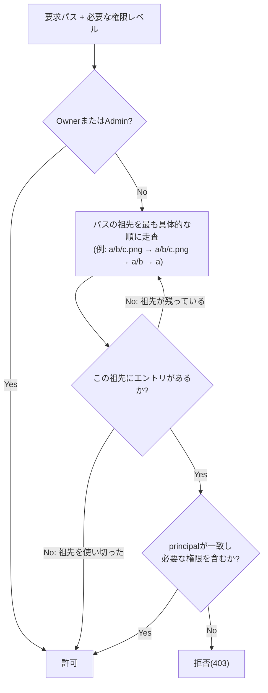
```mermaid
flowchart TD
    A["要求パス + 必要な権限レベル"] --> B{"OwnerまたはAdmin?"}
    B -->|Yes| Allow["許可"]
    B -->|No| C["パスの祖先を最も具体的な順に走査<br/>(例: a/b/c.png → a/b/c.png → a/b → a)"]
    C --> D{"この祖先にエントリがあるか?"}
    D -->|"No: 祖先が残っている"| C
    D -->|"No: 祖先を使い切った"| Allow
    D -->|Yes| E{"principalが一致し<br/>必要な権限を含むか?"}
    E -->|Yes| Allow
    E -->|No| Deny["拒否(403)"]
```

**設計判断**: 「最初に見つかった最も具体的な祖先が勝つ」方式(下位の許可設定が上位の設定を上書きできない、一段階でも具体的な設定があればそれで確定)、かつ「どの階層にも設定が無ければデフォルト許可」——後者は、この機能追加前の事実上の全面公開挙動を壊さないための互換性維持。`access_entries` は`repo_slug`を持たない組織全体のフラットなマップのままである点も意図的(Server Adminのノードエディタ・LoreHub WebのACL画面のどちらもリポジトリ単位のACLという概念を持たないため——詳細はTECHNICAL_REFERENCE.md §4.1)。

### 10.2 RBAC(ロールベースの組織操作ゲート)

パスACLとは独立に、組織そのものを構成する操作——リポジトリ削除、メンバーのロール変更、アクセス制御グラフの一括Apply、メンバー招待の作成/一覧/取り消し——は `is_owner_or_admin(user)` でOwner/Adminロールのみに制限される。「どのファイルを触れるか」(ACL)と「組織構成を変更できるか」(RBAC)は目的の異なる別レイヤーの認可であり、意図的に分離されている。

### 10.3 ネットワークレベルの防御

| 対策 | 内容 |
|---|---|
| セキュアCookie | `Secure`属性つきCookieがデフォルト。`LOREHUB_INSECURE_COOKIES=true`を明示しない限りローカル平文HTTPでもデフォルトは安全側に倒れる |
| CORSオリジン制限 | `LOREHUB_WEB_ORIGIN`で指定した単一オリジンのみ許可(`allow_credentials(true)`のためワイルドカード不可) |
| リクエストボディ上限 | `LOREHUB_MAX_BODY_BYTES`(既定48MiB)、超過時`413` |
| ログインのレート制限 | 送信元IP単位、バースト8回+60秒に1回補充(`tower_governor`)。メールアドレス単位ではない設計——攻撃者が他人のメールアドレスへの失敗リクエストでアカウントをロックできてしまう問題を避けるため |

詳細な環境変数・デフォルト値はTECHNICAL_REFERENCE.md §2.1/§4.2を参照。

## 11. デプロイアーキテクチャ

Phase 9で、それまで存在しなかった「実際に公開デプロイする」ためのインフラ(Docker Compose・CI・観測性)を整備した。その後Phase 11で実際にVercel + Cloudflare Quick Tunnelへデプロイし、そこで見つかったクロスドメインCookie問題を修正した。

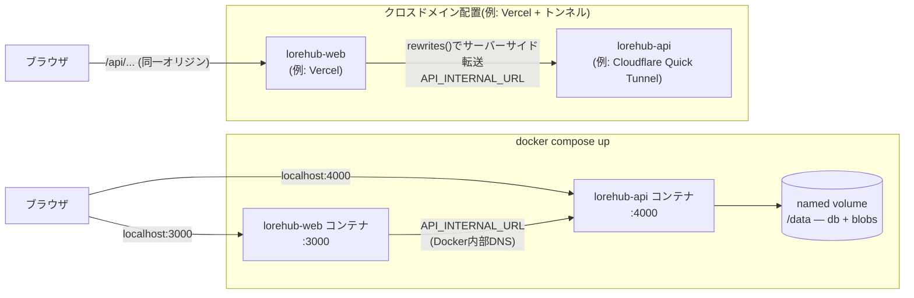
```mermaid
graph LR
    Browser2["ブラウザ"]
    subgraph Compose["docker compose up"]
        WebC["lorehub-web コンテナ<br/>:3000"]
        ApiC["lorehub-api コンテナ<br/>:4000"]
        Vol[("named volume<br/>/data — db + blobs")]
    end
    Browser2 -- "localhost:3000" --> WebC
    Browser2 -- "localhost:4000" --> ApiC
    WebC -- "API_INTERNAL_URL<br/>(Docker内部DNS)" --> ApiC
    ApiC --> Vol

    subgraph Cross["クロスドメイン配置(例: Vercel + トンネル)"]
        WebV["lorehub-web<br/>(例: Vercel)"]
        ApiV["lorehub-api<br/>(例: Cloudflare Quick Tunnel)"]
    end
    Browser3["ブラウザ"] -- "/api/... (同一オリジン)" --> WebV
    WebV -- "rewrites()でサーバーサイド転送<br/>API_INTERNAL_URL" --> ApiV
```

**ローカル/Compose**: ブラウザは`lorehub-web`/`lorehub-api`どちらも同一ホスト名(`localhost`、ポート違いのみ)経由でアクセスするため、`lorehub-api`が発行するセッションCookieは問題なく機能する。永続データは名前付きボリューム1つに`lorehub.db`(SQLite)と`blobs/`(コンテンツアドレスファイル実体)の両方が入る——バックアップは両方が対象(DEPLOYMENT.mdのバックアップ節参照)。

**クロスドメイン配置(実デプロイで発見)**: `lorehub-web`をVercelに、`lorehub-api`を別ドメイン(この検証ではCloudflare Quick Tunnel——アカウント作成不要で無料、再起動のたびにランダムな`*.trycloudflare.com`URLになる制約はこのプロトタイプ段階では許容)に置くと、APIが発行するセッションCookieはAPI自身のドメインにしか保存されず、フロントエンドのドメインへのリクエストには一切送られない——CORSやSameSiteの設定では解決できない、Cookieがそもそもフロントエンドのドメイン下に存在しないため。解決策は「ブラウザにバックエンドの実ドメインを一切見せない」こと: `next.config.ts`の`rewrites()`が`/api/*`をサーバーサイドで`API_INTERNAL_URL`へ転送し、ブラウザが見る`Set-Cookie`は常に`lorehub-web`自身のオリジンのものになる。`NEXT_PUBLIC_USE_API_PROXY=true`がブラウザ側の相対パス切り替えを明示的に指示する(当初`NEXT_PUBLIC_API_URL`を空文字にする方式だったが、ホスティングダッシュボードによっては空文字を確実に保存できず実デプロイで問題が起きたため置き換えた)。**注意**: `rewrites()`はビルド時に評価されるため、`API_INTERNAL_URL`は`npm run build`実行時点で設定済みである必要がある。

**観測性**: `GET /metrics`(Prometheusテキスト形式、method/route/statusごとのリクエスト数+レイテンシヒストグラム)と`GET /api/health`(Dockerの`HEALTHCHECK`が使用する軽量な生存確認、DBアクセスなし)を追加。`tower_http::TraceLayer`は元々配線されていたが実際にはログを一切出力していなかった(デフォルトDEBUGレベルで出力され、デフォルトのINFOフィルタに黙って捨てられていた)というバグをINFOへの引き上げで修正、`LOREHUB_LOG_FORMAT=json`で構造化ログにも対応。デプロイ手順の全体はDEPLOYMENT.mdを参照(本ドキュメントでは重複させない)。

## 12. 現在の状態(このドキュメント作成時点)

- ✅ LoreHub Web: 8画面すべて実装、認証・永続化・リポジトリ設定(rename/削除)・**実チャンクストリーミング(HTTP Range)**・**アカウントライフサイクル(パスワード変更/招待/忘れた/リセット)** まで完了、lint/build/test検証済み
- ✅ lorehub-api: 全エンドポイント認証必須化、**パスACL実強制+RBAC**、**セキュアCookie/CORS/ボディ上限/ログインレート制限**、リポジトリのCRUD完備、**実コンテンツアドレス方式VCS(SHA-256・重複排除・分岐するブランチ・実diff)完備**(§5・§10)、access-control Apply対応、アクセストークン(30分)+リフレッシュトークン(7日、ローテーション付き)のデュアルトークン認証、**HTTP Range配信**、**`/api/health`+`/metrics`(Prometheus)**、**統合テスト118件**
- ✅ LoreForge Client: 閲覧+ロック操作に加え、Fork並みの実操作(コミット/ブランチ/ステージング)、バイナリDiffビューア(画像スライダー/3Dトグル)、**テキスト/音声プレビュー**、**画像/テキスト/音声の実アセットアップロード→自動ステージング**、Sparse Workspace Manager、**セッション自動延長(25分ごとのプロアクティブrefresh)**、**Qt Test**、**Windowsインストーラー(NSIS/CPack)**まで完備
- ✅ LoreForge Server Admin: 実プロセスとしてのLore Server制御(起動/停止/PID/メモリ監視)、権限グラフの実サーバーへのApply、ノードエディタでのディレクトリ/ロールの動的追加・削除、タブ視認性修正、MinIOのDocker制御(実機検証済み)、**セッション自動延長**、**Qt Test**、**Windowsインストーラー(NSIS/CPack)**まで完備
- ✅ lorehub-web: SSR経路(`proxy.ts`)とCSR経路の両方でアクセストークン失効時の透過的リフレッシュに対応、**Vitestによる自動テスト22件**、**クロスドメイン配置向けAPIプロキシ(`NEXT_PUBLIC_USE_API_PROXY`)**
- ✅ デプロイ: `docker-compose.yml`(Rust+Next.jsの2サービス)、GitHub Actions CI、Vercel+Cloudflare Quick Tunnelでの実デプロイ経験(クロスドメインCookie問題を含め修正済み)
- ⏳ 既知の制約: `access_entries`のリポジトリスコープ化(現状は組織全体のフラットなマップ)、コードサイニング証明書(デスクトップインストーラーは未署名)、Clientでの3Dモデルアセットアップロード(実ジオメトリローダーが存在しないため意図的に対象外)
