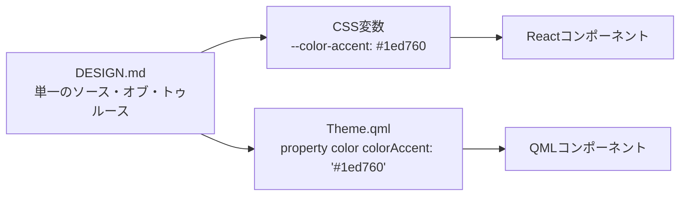
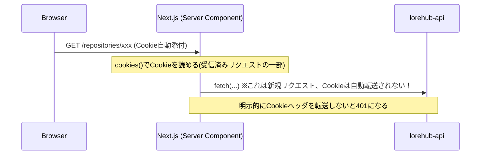
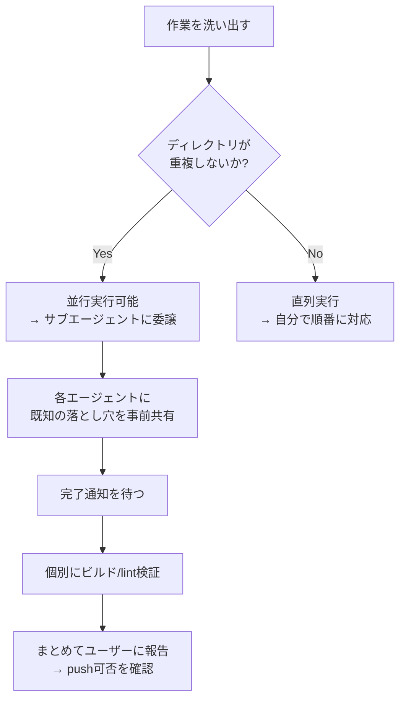

# 講義資料: Lore Ecosystem に学ぶ「マルチコンポーネント設計とAI協働開発」

対象読者: Webフロントエンド/バックエンド、あるいはデスクトップアプリ開発を学ぶエンジニア。Next.js・Rust・Qt/QMLの実例を横断しながら、設計判断の「なぜ」を学ぶことを目的とする。

## 学習目標

この講義を終えると、以下が説明できるようになる。

1. なぜ1つの巨大アプリではなく3つの独立コンポーネントに分割したのか
2. Webとデスクトップアプリで「同じ見た目」を保証する仕組み
3. セッション認証をServer-Side Renderingと組み合わせる際に生じる課題と解法
4. 複雑な状態を持つバックエンドを、正規化せずに永続化する設計判断のトレードオフ
5. AIエージェントを使った並行開発を、コンフリクトなく回す方法

---

## Chapter 1: なぜ3コンポーネントに分割したのか

`ARCHITECTURE.md` は最初に「LoreForge Client」「LoreForge Server Admin」「LoreHub」という3つの独立したアプリケーションを定義した。これは以下の実在するツールの役割分担を意識している。

- GitHub(Webでの閲覧・レビュー) ≒ **LoreHub**
- Fork/GitKraken(ローカルでの実操作) ≒ **LoreForge Client**
- Docker Desktop + 管理コンソール ≒ **LoreForge Server Admin**

**設計上のポイント**: この3つは「同じデータを別UIで見せている」のではなく、**役割そのものが異なる**。LoreHubはブラウザから閲覧・レビューする「見る」アプリ、LoreForge Clientはローカルでコミットする「操作する」アプリ、Server Adminは「インフラを構築する」アプリ。この役割分離を最初に文書化したことで、後続の実装フェーズで「これはどのコンポーネントの仕事か」を毎回AIに確認させる運用ルール(`ARCHITECTURE.md` §5.2)が機能した。

> **考えてみよう**: もしこの3つを1つのElectronアプリに統合していたら、何が失われるか？(ヒント: Webは常に最新版に更新できるが、デスクトップアプリは各クライアントにインストールが必要。役割の違いが配布戦略の違いに直結する。)

---

## Chapter 2: デザイントークンでWeb/デスクトップの一貫性を保つ

Next.js(CSS変数 + Tailwind v4 `@theme inline`)とQt/QML(`Theme.qml`のシングルトン)は全く異なる技術だが、`DESIGN.md` §10「Cross-Platform Token Mapping」が両者の橋渡しをしている。

**実装で得た教訓**: QMLの `pragma Singleton` だけでは動作せず、CMakeで `QT_QML_SINGLETON_TYPE` プロパティを明示しないと**エラーメッセージなしに `undefined` になる**。これは「うまくいかないときに何も言わずに黙って失敗する」典型例で、`WIN32_EXECUTABLE FALSE` で一時的にコンソールを開き `QQmlApplicationEngine::warnings` シグナルを手動で拾うというデバッグ手法が必要だった。GUI開発における「サイレント障害」への対処法として一般化できる教訓。

---

## Chapter 3: セッション認証とServer-Side Renderingの相性問題

Next.jsのServer Componentはブラウザではなく**サーバー上で実行される**ため、ブラウザのCookieジャーにアクセスできない。

この「二段目のfetchにはCookieが自動で乗らない」という落とし穴を `src/lib/auth-server.ts` の `getSessionCookieHeader()` で解決している。Client Componentからのfetchは `credentials: "include"` でブラウザが自動的にCookieを付けてくれるため、Server ComponentとClient Componentで**異なる認証の配線**が必要になる、という非対称性がこのアーキテクチャの重要な理解ポイント。

> **確認問題**: なぜClient Componentの `fetch` には `credentials: "include"` だけで十分なのに、Server Componentではそれが効かないのか？(答え: Client Componentのfetchはブラウザが実行するので、ブラウザ標準のCookie送信ルールに従う。Server Componentのfetchはサーバー内のNode.jsプロセスが実行するため、ブラウザのCookieジャーとは無関係な別の通信になる。)

---

## Chapter 4: 「正規化しない」永続化という設計判断

`lorehub-api/src/db.rs` は、`AppState` の各フィールド(リポジトリ一覧、PR一覧、監査ログ…)をそれぞれ1つのJSONブロブとして `kv_store` テーブルに保存する。

一般的なDB設計の教科書では「正規化してテーブルを分けるべき」と教わるが、ここではあえてそれをしていない。理由:

1. Rustの構造体をそのまま `serde_json` でシリアライズ/デシリアライズでき、スキーマとコードが常に同期する
2. デモ〜小規模組織のデータ量では複雑なJOINクエリが不要
3. スキーマ変更(フィールド追加など)がマイグレーション不要で即座に反映される

**トレードオフとして失うもの**: SQLでの集計・絞り込みができない(全件ロードしてRust側でフィルタする)。これは「将来的にデータ量が増えたら破綻する」設計であることを自覚した上での意図的な選択であり、`TECHNICAL_REFERENCE.md` §7 に明記している。

> **議論ポイント**: この設計判断は「時期尚早な最適化を避ける」原則の実例である。データ量が実際に問題になった時点でリレーショナル設計に移行すればよい、という判断は正しいか？ どのような兆候が出たら移行すべきタイミングと言えるか？

---

## Chapter 5: AIエージェントによる並行開発

このプロジェクトの後半フェーズでは、次の3つの作業を**同時に**進めた。

1. LoreHub Web にリポジトリ設定機能(rename/削除)を追加 — メインセッションが直接実装
2. LoreForge Client にコミット履歴ビューを追加 — バックグラウンドサブエージェント
3. LoreForge Server Admin に権限設定の永続化を追加 — バックグラウンドサブエージェント

**成功の鍵は「スコープの分離」**: 3つの作業は異なるディレクトリ(`lorehub-web/`, `loreforge-client/`, `loreforge-server-admin/`)に閉じていたため、Gitの差分がコンフリクトしなかった。もし3つとも同じ `lorehub-api/` を変更する作業だったら、並行実行は避けて直列で進めるべきだった。

**もう一つの鍵は「知識の伝播」**: 最初のエージェントが発見した罠(例: `QStringLiteral` はリテラルトークンが必要で `const char*` 定数では使えない、`SendInput` によるクリックはこのサンドボックスでは届かない)を、後続のエージェントのプロンプトに引き継ぐことで、同じ問題を2度調査する無駄を防いだ。

> **演習**: あなたが3つ目のタスク(例えばドキュメント作成)を並行実行に含めるかどうかを判断するとしたら、何を基準にするか？(ヒント: 他の作業と同じファイル/ディレクトリを触るか、成果物が他の作業の完了を前提とするか。)

---

## まとめ

| 学んだこと | 具体例 |
|---|---|
| 役割による分割 | LoreHub / Client / Server Adminの3分割 |
| 単一ソース・オブ・トゥルース | DESIGN.mdのトークンをWeb/Qt両方が参照 |
| SSRとCookieの非対称性 | Server ComponentとClient Componentで異なる配線が必要 |
| 意図的な設計トレードオフ | kv_store方式の永続化 |
| 並行開発の設計原則 | ディレクトリ非重複 + 知識の事前伝播 |
