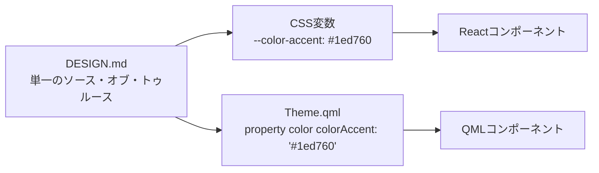
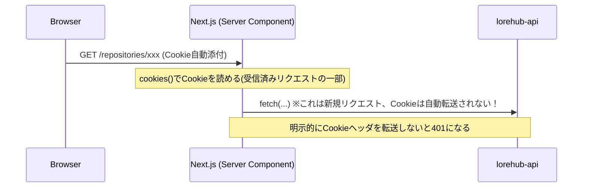
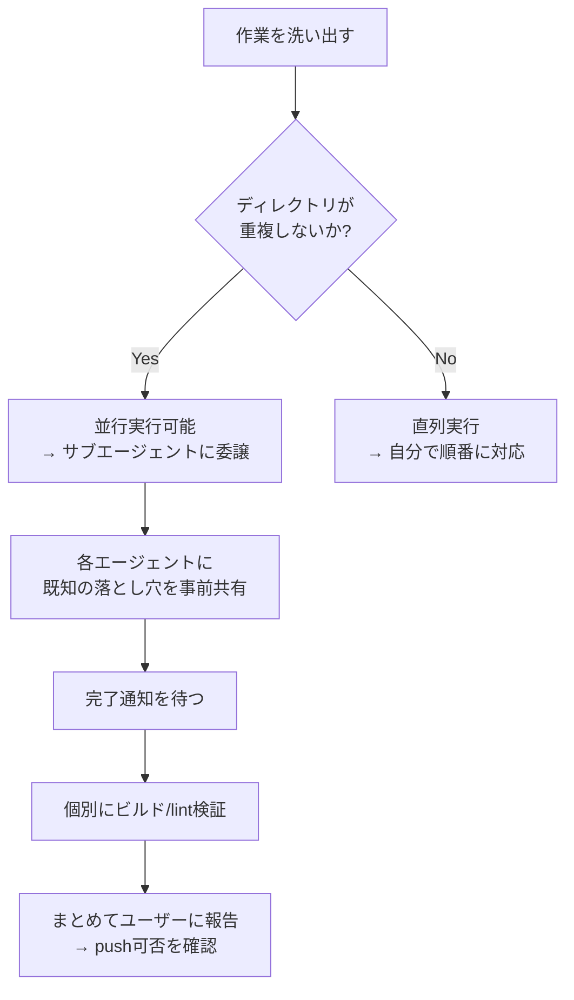
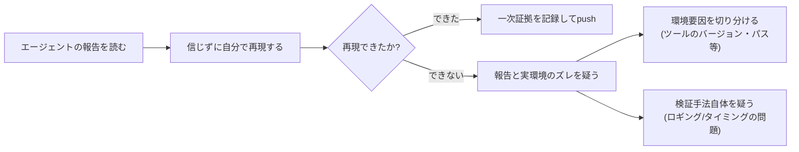
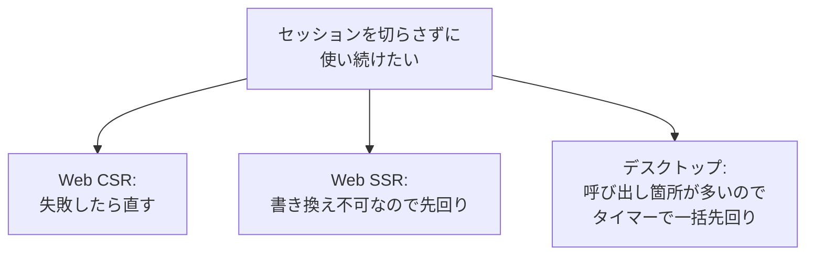
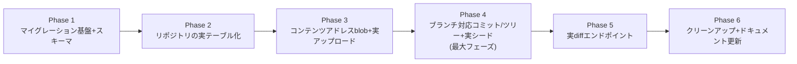
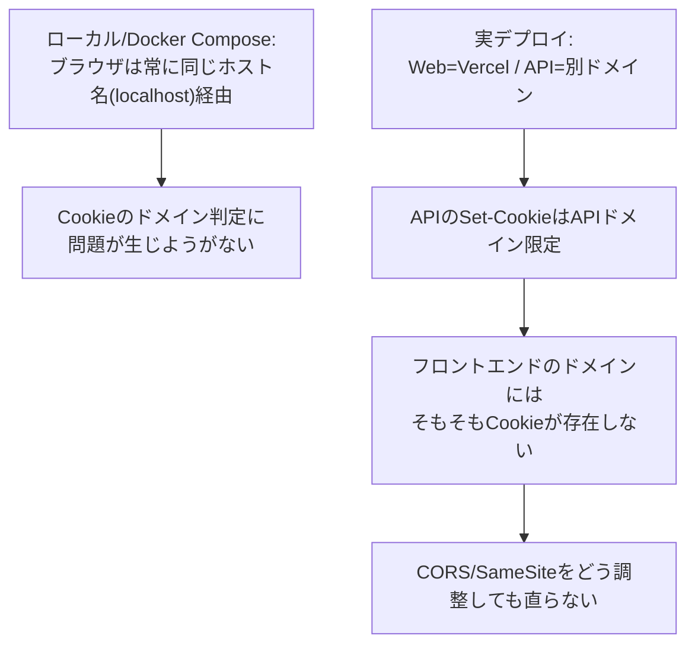

# 講義資料: Lore Ecosystem に学ぶ「マルチコンポーネント設計とAI協働開発」

対象読者: Webフロントエンド/バックエンド、あるいはデスクトップアプリ開発を学ぶエンジニア。Next.js・Rust・Qt/QMLの実例を横断しながら、設計判断の「なぜ」を学ぶことを目的とする。

## 学習目標

この講義を終えると、以下が説明できるようになる。

1. なぜ1つの巨大アプリではなく3つの独立コンポーネントに分割したのか
2. Webとデスクトップアプリで「同じ見た目」を保証する仕組み
3. セッション認証をServer-Side Renderingと組み合わせる際に生じる課題と解法
4. 複雑な状態を持つバックエンドを、正規化せずに永続化する設計判断のトレードオフ
5. AIエージェントを使った並行開発を、コンフリクトなく回す方法
6. AIエージェントの完了報告を、なぜ・どうやって独立に再検証するか
7. 「同じ問題」に対して実行環境の制約が異なると解法も変わるべき理由(トークンリフレッシュを例に)
8. 「動いているように見える」実装と「本物」の実装を見分け、いつ部分修正ではなく書き直しが必要かを判断する方法(VCSバックエンドの全面再設計を例に)
9. 実際のデプロイで初めて表面化する問題を、推測ではなく一次証拠(配信されたJSバンドルの中身、プラットフォーム公式ドキュメント)から診断する姿勢

---

## Chapter 1: なぜ3コンポーネントに分割したのか

`ARCHITECTURE.md` は最初に「LoreForge Client」「LoreForge Server Admin」「LoreHub」という3つの独立したアプリケーションを定義した。これは以下の実在するツールの役割分担を意識している。

- GitHub(Webでの閲覧・レビュー) ≒ **LoreHub**
- Fork/GitKraken(ローカルでの実操作) ≒ **LoreForge Client**
- Docker Desktop + 管理コンソール ≒ **LoreForge Server Admin**

**設計上のポイント**: この3つは「同じデータを別UIで見せている」のではなく、**役割そのものが異なる**。LoreHubはブラウザから閲覧・レビューする「見る」アプリ、LoreForge Clientはローカルでコミットする「操作する」アプリ、Server Adminは「インフラを構築する」アプリ。この役割分離を最初に文書化したことで、後続の実装フェーズで「これはどのコンポーネントの仕事か」を毎回AIに確認させる運用ルール(`ARCHITECTURE.md` §5.2)が機能した。

> **考えてみよう**: もしこの3つを1つのElectronアプリに統合していたら、何が失われるか？(ヒント: Webは常に最新版に更新できるが、デスクトップアプリは各クライアントにインストールが必要。役割の違いが配布戦略の違いに直結する。)

---

## Chapter 2: デザイントークンでWeb/デスクトップの一貫性を保つ

Next.js(CSS変数 + Tailwind v4 `@theme inline`)とQt/QML(`Theme.qml`のシングルトン)は全く異なる技術だが、`DESIGN.md` §10「Cross-Platform Token Mapping」が両者の橋渡しをしている。

```mermaid
graph LR
    Source["DESIGN.md<br/>単一のソース・オブ・トゥルース"]
    Source --> CSS["CSS変数<br/>--color-accent: #1ed760"]
    Source --> QML["Theme.qml<br/>property color colorAccent: '#1ed760'"]
    CSS --> WebComponents["Reactコンポーネント"]
    QML --> QMLComponents["QMLコンポーネント"]
```

**実装で得た教訓**: QMLの `pragma Singleton` だけでは動作せず、CMakeで `QT_QML_SINGLETON_TYPE` プロパティを明示しないと**エラーメッセージなしに `undefined` になる**。これは「うまくいかないときに何も言わずに黙って失敗する」典型例で、`WIN32_EXECUTABLE FALSE` で一時的にコンソールを開き `QQmlApplicationEngine::warnings` シグナルを手動で拾うというデバッグ手法が必要だった。GUI開発における「サイレント障害」への対処法として一般化できる教訓。

---

## Chapter 3: セッション認証とServer-Side Renderingの相性問題

Next.jsのServer Componentはブラウザではなく**サーバー上で実行される**ため、ブラウザのCookieジャーにアクセスできない。

```mermaid
sequenceDiagram
    participant Browser
    participant NextServer as Next.js (Server Component)
    participant API as lorehub-api

    Browser->>NextServer: GET /repositories/xxx (Cookie自動添付)
    Note over NextServer: cookies()でCookieを読める(受信済みリクエストの一部)
    NextServer->>API: fetch(...) ※これは新規リクエスト、Cookieは自動転送されない！
    Note over NextServer,API: 明示的にCookieヘッダを転送しないと401になる
```

この「二段目のfetchにはCookieが自動で乗らない」という落とし穴を `src/lib/auth-server.ts` の `getSessionCookieHeader()` で解決している。Client Componentからのfetchは `credentials: "include"` でブラウザが自動的にCookieを付けてくれるため、Server ComponentとClient Componentで**異なる認証の配線**が必要になる、という非対称性がこのアーキテクチャの重要な理解ポイント。

> **確認問題**: なぜClient Componentの `fetch` には `credentials: "include"` だけで十分なのに、Server Componentではそれが効かないのか？(答え: Client Componentのfetchはブラウザが実行するので、ブラウザ標準のCookie送信ルールに従う。Server Componentのfetchはサーバー内のNode.jsプロセスが実行するため、ブラウザのCookieジャーとは無関係な別の通信になる。)

---

## Chapter 4: 「正規化しない」永続化という設計判断

`lorehub-api/src/db.rs` は、`AppState` の各フィールド(PR一覧、監査ログ、組織メンバー…)をそれぞれ1つのJSONブロブとして `kv_store` テーブルに保存する。

一般的なDB設計の教科書では「正規化してテーブルを分けるべき」と教わるが、ここではあえてそれをしていない。理由:

1. Rustの構造体をそのまま `serde_json` でシリアライズ/デシリアライズでき、スキーマとコードが常に同期する
2. デモ〜小規模組織のデータ量では複雑なJOINクエリが不要
3. スキーマ変更(フィールド追加など)がマイグレーション不要で即座に反映される

**トレードオフとして失うもの**: SQLでの集計・絞り込みができない(全件ロードしてRust側でフィルタする)。これは「将来的にデータ量が増えたら破綻する」設計であることを自覚した上での意図的な選択であり、`TECHNICAL_REFERENCE.md` §5 に明記している。

**実際にその兆候が出た実例**: リポジトリ一覧・コミット履歴・ファイルツリーは元々この同じkv_storeブロブ方式で保存されていたが、「実データを乗せる前提で公開する」という要件が来た時点で、コミットハッシュが実際にはランダム生成のフェイク値でしかない、ツリーが全リポジトリ共有の静的スナップショットでしかない、といった「正規化していないがゆえに真の意味でバージョン管理ができていない」実害が表面化した。そこでVCSデータだけを実コンテンツアドレス方式の正規化SQLテーブル(`repositories`/`commits`/`branches`/`tree_entries`/`file_blobs`など)へ切り出す再設計を行った一方、PR一覧・監査ログ・組織メンバーなど残りのデータは同じ制約下でも実害が出ていないため、意図的にkv_storeブロブ方式のまま据え置いている。

> **議論ポイント**: この設計判断は「時期尚早な最適化を避ける」原則の実例である。データ量が実際に問題になった時点でリレーショナル設計に移行すればよい、という判断は正しいか？ どのような兆候が出たら移行すべきタイミングと言えるか?(上記のVCSデータ移行が実例の1つになる — 「クエリが遅い」ではなく「正規化していないことが機能そのものを壊していた」という兆候だった点に注目)

---

## Chapter 5: AIエージェントによる並行開発

このプロジェクトの後半フェーズでは、次の3つの作業を**同時に**進めた。

1. LoreHub Web にリポジトリ設定機能(rename/削除)を追加 — メインセッションが直接実装
2. LoreForge Client にコミット履歴ビューを追加 — バックグラウンドサブエージェント
3. LoreForge Server Admin に権限設定の永続化を追加 — バックグラウンドサブエージェント

```mermaid
flowchart TD
    A["作業を洗い出す"] --> B{"ディレクトリが<br/>重複しないか?"}
    B -->|Yes| C["並行実行可能<br/>→ サブエージェントに委譲"]
    B -->|No| D["直列実行<br/>→ 自分で順番に対応"]
    C --> E["各エージェントに<br/>既知の落とし穴を事前共有"]
    E --> F["完了通知を待つ"]
    F --> G["個別にビルド/lint検証"]
    G --> H["まとめてユーザーに報告<br/>→ push可否を確認"]
```

**成功の鍵は「スコープの分離」**: 3つの作業は異なるディレクトリ(`lorehub-web/`, `loreforge-client/`, `loreforge-server-admin/`)に閉じていたため、Gitの差分がコンフリクトしなかった。もし3つとも同じ `lorehub-api/` を変更する作業だったら、並行実行は避けて直列で進めるべきだった。

**もう一つの鍵は「知識の伝播」**: 最初のエージェントが発見した罠(例: `QStringLiteral` はリテラルトークンが必要で `const char*` 定数では使えない、`SendInput` によるクリックはこのサンドボックスでは届かない)を、後続のエージェントのプロンプトに引き継ぐことで、同じ問題を2度調査する無駄を防いだ。

> **演習**: あなたが3つ目のタスク(例えばドキュメント作成)を並行実行に含めるかどうかを判断するとしたら、何を基準にするか？(ヒント: 他の作業と同じファイル/ディレクトリを触るか、成果物が他の作業の完了を前提とするか。)

---

## Chapter 6: 「動きました」を信じない — 独立再検証の実践

このプロジェクトの後半、サブエージェントに実装を委譲する運用が定着した後、**エージェントの完了報告を鵜呑みにせず、オーケストレーター(人間役のメインセッション)が毎回ゼロから独立して再検証する**というルールを徹底した。

具体的な手順は次の通り。

1. サブエージェントの `build/` ディレクトリを完全に削除し、ゼロからクリーンビルドする(キャッシュされた成果物ではなく、コミットされたソースだけから再現できるかを確認)
2. 報告された動作を、報告内容を見ずに**自分の手で再現**する(同じcurlコマンド、同じUI操作)
3. 「動いた」の証拠を一次情報で取る — スクリーンショットではなく実プロセスのPID、`tasklist`の出力、HTTPレスポンスの実バイト数、Windowsレジストリの値そのもの
4. 検証用に一時的に仕込んだコード(このプロジェクトでは `TEMP-VERIFY` というコメントタグで統一)が完全に除去されているか `grep` で確認してからコミット・push

この徹底により、報告だけでは分からなかった2つの問題を発見できた。

**環境ドリフト**: 開発マシンのVisual Studioインストールが、セッションの途中で `...\2022\Community\...` というパスから `...\18\Community\...` へ自動更新されていた。ビルドスクリプトにパスをハードコードしていたため、独立検証の1回目が原因不明のエラーで失敗し、調査した結果ようやく判明した。サブエージェント自身のビルド時点ではまだ古いパスが有効だったため、この問題はサブエージェントの報告には一切現れない。

**検証手法自体の欠陥**: QMLの `console.log` は、標準出力がファイルにリダイレクトされているとフルバッファリングされ、プロセスを明示的に終了させるまでログに現れないことがある。また、ログイン→一覧画面→詳細画面という複数の画面遷移を伴うTimerチェーンで自動操作を再現しようとしたところ、原因不明のまま何も起きないことがあった。この時は原因追及に時間をかけず、検証したいC++型(画像プロバイダやツリーモデルなど)だけを直接インスタンス化する最小限の専用QMLファイルに切り替えるという方針転換で解決した — 複雑な統合を検証するより、検証したい部品を直接動かす方が速く確実、という判断。

```mermaid
flowchart LR
    A["エージェントの報告を読む"] --> B["信じずに自分で再現する"]
    B --> C{"再現できたか?"}
    C -->|できた| D["一次証拠を記録してpush"]
    C -->|できない| E["報告と実環境のズレを疑う"]
    E --> F["環境要因を切り分ける<br/>(ツールのバージョン・パス等)"]
    E --> G["検証手法自体を疑う<br/>(ロギング/タイミングの問題)"]
```

> **議論ポイント**: 「エージェントの報告を信じない」という運用は、人間のチームメイトに対しても同じように適用すべきか？ AIエージェントに対してだけ特別に厳格な検証を課すことの是非を考えてみよう。(ヒント: 人間のPRレビューでも「動作確認済み」という自己申告だけでマージすることは少ない。違いがあるとすれば、エージェントは疲れも忖度もなく同じ厳密さで何度でも再検証をこなせる点かもしれない。)

---

## Chapter 7: 同じ問題、3つの異なる解法 — 環境の制約が設計を決める

セッショントークンを30分で失効させた結果、「失効前後でどうユーザー体験を継続させるか」という同じ問題が、このプロジェクトの3種類のクライアント(Web CSR・Web SSR・デスクトップアプリ)それぞれで**別々の解法**を必要とした。

| クライアント | 解法 | なぜこの解法か |
|---|---|---|
| Web(CSR、ブラウザのfetch) | リアクティブ: 401を検知してから `refresh` → 1回だけ再試行 | ブラウザは常にオンラインの対話セッションなので、実際に失敗した時だけ直せば十分。先回りする理由が無い |
| Web(SSR、Server Component) | プロアクティブ: レンダリング前にアクセスCookie欠落を検知して先回りrefresh | Server ComponentはCookieを書き換えられない制約があるため、失敗してから直す(リアクティブ)という選択肢がそもそも取れない。`proxy.ts` というレンダリング前のレイヤーだけが両方(読み書き)にアクセスできる |
| デスクトップアプリ(Client/Server Admin) | プロアクティブ: ログイン中は25分ごとにタイマーで無条件refresh | 個々のネットワーク呼び出し箇所(`QNetworkReply` ベース)全てに401リトライを後付けするのは、リクエストの再送(POSTボディの保持など)を伴う複雑な汎用リプレイ機構が必要になり、得られる価値に対してコストが高すぎる。「セッションを生かし続ける」というゴールだけなら定期タイマーの方が単純で壊れにくい |

3つとも「セッションを切らさない」という同じゴールを持ちながら、採用した実装は三者三様だった。これは各環境の**具体的な制約**(Cookie書き換え可否、コールサイトの数、失敗時の見え方)を見てから解法を選んだ結果であり、「1つの正解パターンを全環境にコピーする」のではなく「同じ問題でも環境が変われば最適解も変わる」ことを示す実例になっている。

```mermaid
flowchart TD
    Q["セッションを切らさずに<br/>使い続けたい"]
    Q --> W1["Web CSR:<br/>失敗したら直す"]
    Q --> W2["Web SSR:<br/>書き換え不可なので先回り"]
    Q --> D["デスクトップ:<br/>呼び出し箇所が多いので<br/>タイマーで一括先回り"]
```

> **議論ポイント**: もしこのプロジェクトが最初から「リアクティブ方式に統一する」という方針を立てていたら、SSRとデスクトップアプリでそれぞれどんな無理が生じていたか？ 逆に「プロアクティブ方式に統一する」方針だったら、Web CSRではどんな無駄が生じるか?(ヒント: SSRは書き換え不可という制約自体は変わらないので、リアクティブ方式に統一しようとしても失敗を検知した後にできることがない。デスクトップアプリを完全リアクティブにするには、全呼び出し箇所を汎用リトライ機構でラップする大規模な設計変更が要る。逆にWeb CSRを常時プロアクティブにすると、ユーザーがタブを開いたまま何もしていない間も無駄なリフレッシュ呼び出しが走り続ける。)

---

## Chapter 8: 「デモ形」実装を見抜く — VCSバックエンド全面再設計というケーススタディ

このプロジェクトで最大規模の書き直しは、`lorehub-api`の「VCS」機能そのものだった。Chapter 4で扱った「正規化しない」というkv_storeの設計判断とは対照的に、こちらは**意図的なトレードオフではなく、後から発覚した「見た目だけそれらしい」実装**だったという点が重要な違いになる。

### 8.1 何が「デモ形」だったか

調査の結果、判明した実態は次の通りだった。

- コミットハッシュは20バイトのランダム値 — 実際のファイル内容とは何の関係も無い
- ファイルツリーは全リポジトリで共有される1つの静的スナップショット — リポジトリごとの違いすら無い
- ブランチを切り替えても`GET /tree`が返す内容は変わらない — チェックアウトが実質何もしていない
- ファイルアップロードは既存バイト列への上書きで、過去バージョンは跡形もなく消える
- diffアルゴリズムはコード上どこにも存在せず、PR画面の差分は100%手書きのシードデータ
- 永続化は`AppState`の各フィールドを丸ごと1個のJSONブロブとして書き直す方式(Chapter 4)——これが後述する実害の根本原因でもあった

UI上は「コミットが並び」「ツリーが表示され」「PRの差分が見える」ため、**デモとして見る分には何一つ壊れて見えない**。これが「デモ形」実装の怖さで、動作確認のチェックリストが全部緑になっていても、内部で何が本物で何が書き割りかは、コードを読むか意図的に検証しない限り分からない。

### 8.2 発覚のきっかけ — 「実データを乗せる前提」という要求の変化

このギャップは、機能追加の途中で見つかったのではなく、「本格的な実データ(実際のゲーム開発アセット、実際のバージョン履歴)を乗せる前提で公開したい」という要求が明確になった時点で発覚した。それまでの用途(デモ・UI検証)では誰も困っていなかった実装が、**判定基準が変わった瞬間に「使えない」に反転した**——コードは1行も変わっていないのに。

> **考えてみよう**: 「動いている」という評価は常に何らかの基準に対して行われる。このプロジェクトでは基準が「デモとして見せられるか」から「実データの永続的な管理に耐えるか」へ変わった。あなたが今取り組んでいる実装は、どんな基準の変化に対して脆いか?(ヒント: パフォーマンス要求の変化、同時アクセス数の増加、要求される保存期間の延長なども同じ構造の「基準の反転」を引き起こしうる。)

### 8.3 「部分修正」ではなく「書き直し」を選んだ理由

コミットハッシュだけ本物にする、diffだけ後付けする、といった部分修正ではなく全面再設計を選んだのは、これらの欠陥が互いに独立していなかったためである。実ハッシュを計算するにはステージされた内容が実際にアップロード済みである保証が要り、ブランチが意味を持つには各コミットが実ツリースナップショットを持つ必要があり、diffを計算するには2つの実コンテンツを実際に読み出せる必要がある——**1つを直すには他の複数を同時に直す必要がある**、密結合した嘘の集合だった。

一方で、全面再設計であっても「どこまでやるか」には明確な線を引いた。Git本来のマージコミット・コンフリクト解決・パックファイルは対象外とし、Perforce/Plastic SCM的な「単一親のみ・チーム向けアセットバージョン管理」という、この用途に見合った水準を最初に確定させた(既存のシード済みマージコミットは、単一親の分岐ブランチ2本として意図的に作り直した)。「本物にする」ことは「Gitと同じ機能を全部実装する」ことではない——スコープを無限に広げず、必要な水準を先に決めることが、書き直しを完遂可能な大きさに保つ鍵だった。

### 8.4 フェーズ分割と既存クライアントとの互換性

6フェーズに分割し、各フェーズごとに実装→テスト→実サーバー検証→コミットのサイクルを回した。

```mermaid
flowchart LR
    P1["Phase 1<br/>マイグレーション基盤+スキーマ"] --> P2["Phase 2<br/>リポジトリの実テーブル化"]
    P2 --> P3["Phase 3<br/>コンテンツアドレスblob+実アップロード"]
    P3 --> P4["Phase 4<br/>ブランチ対応コミット/ツリー+実シード<br/>(最大フェーズ)"]
    P4 --> P5["Phase 5<br/>実diffエンドポイント"]
    P5 --> P6["Phase 6<br/>クリーンアップ+ドキュメント更新"]
```

各フェーズの区切りは「レスポンスのJSON形状を変えずに、値の中身だけ本物にできる境界」で引かれている。例えば`Commit.hash`は40桁→64桁のhex文字列に変わったが、フィールド名や型(文字列)は変わっていない——両クライアント(`lorehub-web`/`loreforge-client`)はハッシュを不透明な表示文字列として扱っているだけだったため、実害なくワイヤーフォーマット互換を保てた。「内部実装は嘘から本物に総取り替えするが、外部契約(API形状)は可能な限り変えない」という制約を先に決めたことで、2つの独立クライアントを同時に改修する必要が無くなり、書き直しの範囲を`lorehub-api`単体に閉じ込められた。

> **議論ポイント**: もし「ワイヤーフォーマットを変えない」という制約を最初から置かなかったら、この再設計はどう変わっていたか?(ヒント: `lorehub-web`と`loreforge-client`の両方を同時に改修する必要が生まれ、3つのコンポーネントを同時に壊れた状態にしたまま進める期間が発生する。フェーズごとに独立してテスト・デプロイできるという今回の進め方自体が成立しなくなる。)

---

## Chapter 9: 実デプロイで初めて発覚する問題 — クロスドメインCookieの診断と修正

ローカル開発やDocker Composeでの検証を何度重ねても再現しない不具合が、実際に本番相当の環境へデプロイした瞬間に初めて表面化することがある。このプロジェクトでも、`lorehub-web`をVercelへ、`lorehub-api`をCloudflare Quick Tunnel(アカウント作成不要・無料。再起動のたびにURLが変わる制約はプロトタイプ段階では許容と判断)経由で公開した際に、まさにこれが起きた。

### 9.1 なぜローカルでは一度も再現しなかったのか

`lorehub-api`が発行するセッションCookieは、レスポンスを返した**そのドメインにしか保存されない**。ローカル開発でもDocker Composeでも、ブラウザは`lorehub-web`(`localhost:3000`)と`lorehub-api`(`localhost:4000`)のどちらにも同じ`localhost`というホスト名でアクセスしている——ポートが違うだけで、ブラウザのCookie判定はホスト単位でありポート単位ではないため、この構成では問題が起きようがなかった。

Vercel(`lore-desktop-and-web-system.vercel.app`)とCloudflare Quick Tunnel(`*.trycloudflare.com`)という**本当に別のドメイン**同士になって初めて、「APIが発行したCookieはAPIのドメインにしか保存されず、フロントエンドのドメインへのリクエストには一切乗らない」という事実が表面化した。CORSの許可オリジンを正しく設定しても、SameSite属性をどう調整しても直らない——そもそもCookie自体がフロントエンドのドメイン配下に存在しないのだから、送信されるはずがない。

```mermaid
flowchart TD
    A["ローカル/Docker Compose:<br/>ブラウザは常に同じホスト名(localhost)経由"] --> B["Cookieのドメイン判定に<br/>問題が生じようがない"]
    C["実デプロイ:<br/>Web=Vercel / API=別ドメイン"] --> D["APIのSet-CookieはAPIドメイン限定"]
    D --> E["フロントエンドのドメインには<br/>そもそもCookieが存在しない"]
    E --> F["CORS/SameSiteをどう調整しても直らない"]
```

### 9.2 解決策: ブラウザにバックエンドの実ドメインを見せない

CookieのドメインスコープはHTTPの根本的な仕様であり、設定の調整では回避できない。代わりに採った方針は「ブラウザが直接触れるオリジンを1つに統一する」こと——`next.config.ts`の`rewrites()`で、ブラウザからの`/api/...`リクエストを`lorehub-web`自身のオリジンで受け止め、サーバーサイドで実バックエンドへ転送する。ブラウザが目にする`Set-Cookie`は常に`lorehub-web`自身のオリジンのものになるため、Cookieが正しいドメインに保存される。

ここで見落としがちな罠が1つあった: Next.jsの`rewrites()`は**ビルド時に評価される**設定であり、コンテナ/プロセスの起動時に毎回読み直されるわけではない。転送先を指す環境変数(`API_INTERNAL_URL`)は`npm run build`実行時点で確定していないと反映されない——「環境変数を設定してから再起動すれば直る」という直感が通用しない箇所であり、実際にビルドとデプロイのタイミングを混同すると原因不明の挙動として現れる。

### 9.3 独立検証の実践: 配信されたJSバンドルを直接読む

最初の修正では「`NEXT_PUBLIC_API_URL`を空文字にすることでプロキシモードを暗黙的に示す」という設計にしたが、実際にVercelへデプロイして動作確認したところログインが直らなかった。ここでChapter 6と同じ姿勢——「動くはず」という報告や設定画面の表示を信じず、一次証拠を自分で取りに行く——を適用し、**実際に配信されているクライアントJSバンドルをブラウザの開発者ツールから直接読んで**、`NEXT_PUBLIC_API_URL`に古いトンネルURLが依然としてハードコードされていることを突き止めた。ホスティングダッシュボードの入力欄が「空にしたつもり」でも、実際には空文字として確実に保存されるとは限らない——これはダッシュボードのUIを信用せず、ビルド成果物そのものを検証したことで初めて分かった事実である。

この発見を受けて、`NEXT_PUBLIC_API_URL`が空かどうかに依存する暗黙的な判定をやめ、`NEXT_PUBLIC_USE_API_PROXY=true`という**それ専用の明示的なフラグ**に置き換えた。「空であること」を条件にするのではなく、「意図がそこにあること」を直接表現する変数にする——設定の意図を値の不在ではなく値の存在で伝えるという、地味だが再現性のある教訓。

### 9.4 デプロイ作業で実際に起きた2つの設定ミス

実際にVercelのダッシュボードで環境変数を設定する過程では、コードとは無関係な運用上のミスも2つ発生した。

1. **タイプミス**: `NEXT_PUBLIC_USE_API_PROXY`を`NEXT_PUBLIC_USE_API_PROX`(末尾の"Y"が欠落)と入力してしまい、フラグが一致せず機能しなかった。
2. **根拠のない思い込み**: Vercelの環境変数に用意されている「Sensitive」フラグを付けると、ビルド時に値が読み取れなくなるのではないかという懸念があったが、これはVercel公式ドキュメントを確認して確定的に誤りだと判明した——Sensitive環境変数はビルド時には通常通り利用可能で、ビルドログへの出力がマスクされ、作成後はダッシュボード上で値を再確認できなくなるだけである。

> **議論ポイント**: 2つ目の「根拠のない思い込み」は、確認さえすれば5分で解消する種類の疑問だった。それでも一度は疑い、公式ドキュメントで裏取りをする価値はあるか? それとも「動かなければ後で疑えばいい」で十分か?(ヒント: このケースでは疑いが的中しなかった=時間を使った割に得るものが無かったように見えるが、「Sensitiveフラグが原因ではない」と確定させたことで、原因調査の範囲から1つの仮説を確実に除外できている。デバッグは「正しい仮説を当てる」より「間違った仮説を確実に消していく」作業である、という捉え方もできる。)

---

## まとめ

| 学んだこと | 具体例 |
|---|---|
| 役割による分割 | LoreHub / Client / Server Adminの3分割 |
| 単一ソース・オブ・トゥルース | DESIGN.mdのトークンをWeb/Qt両方が参照 |
| SSRとCookieの非対称性 | Server ComponentとClient Componentで異なる配線が必要 |
| 意図的な設計トレードオフ | kv_store方式の永続化 |
| 並行開発の設計原則 | ディレクトリ非重複 + 知識の事前伝播 |
| 独立再検証の原則 | 一次証拠(PID/HTTPレスポンス/レジストリ)を自分で取る、報告を鵜呑みにしない |
| 環境の制約に合わせた解法選択 | セッションリフレッシュ: Web CSRはリアクティブ、Web SSR/デスクトップはプロアクティブ |
| 「デモ形」実装の見抜き方と書き直しの判断 | VCSバックエンド全面再設計(ランダムハッシュ→SHA-256、静的ツリー→ブランチ分岐、上書き→重複排除つき履歴保持) |
| スコープを決めてから書き直す | 単一親のみ・マージ非対応と最初に線引き、ワイヤーフォーマット互換で2クライアントの改修を回避 |
| 一次証拠でのデプロイ問題診断 | クロスドメインCookie問題を配信JSバンドルの直接確認から特定、公式ドキュメントでの裏取り |
